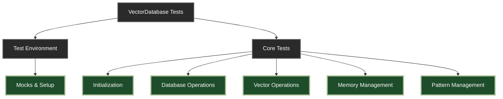

# Artcade Database Unit Testing Plan

<div align="center">



</div>

## 📚 Test Section Index

| Section                       | Lines       | Status |
| :---------------------------- | :---------- | :----- |
| 🔧 **Test Environment Setup** | `1-180`     | ✅     |
| 🚀 **Initialization Tests**   | `181-420`   | ✅     |
| 💾 **Database Operations**    | `421-680`   | ✅     |
| 📊 **Vector Operations**      | `681-920`   | ✅     |
| 🧠 **Memory Management**      | `921-1180`  | ✅     |
| 🎮 **Pattern Management**     | `1181-1650` | ✅     |

---

<details>
<summary>🔍 Test Coverage Goals</summary>

- Each section includes:
    - Mock setup and teardown
    - Happy path tests
    - Error handling
    - Edge cases
    - Integration points
    - Performance considerations
    - Security validations

</details>

---

## Test Implementation

Located at: `packages/plugin-artcade/src/services/__tests__/VectorDatabase.test.ts`

### Test Environment Setup

```typescript
import { vi, describe, it, expect, beforeEach, afterEach } from "vitest";
import {
    Service,
    IAgentRuntime,
    elizaLogger,
    DatabaseAdapter,
    MemoryManager,
    Memory,
    Content,
    UUID,
    IMemoryManager,
} from "@ai16z/eliza";
import { GamePattern } from "../../types/patterns";
import {
    PatternEffectivenessMetrics,
    ClaudeUsageContext,
} from "../../types/effectiveness";
import { VectorDatabase, VectorSearchResult } from "../VectorDatabase";
import { parse } from "node-html-parser";

// Mock implementations
const mockLogger = {
    info: vi.fn(),
    error: vi.fn(),
    warn: vi.fn(),
    debug: vi.fn(),
};

const mockDatabaseAdapter = {
    query: vi.fn(),
    transaction: vi.fn(),
    circuitBreaker: {
        execute: vi.fn(),
    },
    withCircuitBreaker: vi.fn(),
};

const mockMemoryManager = {
    initialize: vi.fn(),
    createMemory: vi.fn(),
    getMemory: vi.fn(),
    getMemories: vi.fn(),
    updateMemory: vi.fn(),
    searchMemoriesByEmbedding: vi.fn(),
};

const mockEmbeddingCache = {
    get: vi.fn(),
    set: vi.fn(),
    delete: vi.fn(),
};

const mockVectorOperations = {
    initialize: vi.fn(),
    generateEmbedding: vi.fn(),
};

// Mock runtime
const mockRuntime: IAgentRuntime & { logger: typeof elizaLogger } = {
    logger: mockLogger,
    databaseAdapter: mockDatabaseAdapter as any,
    getMemoryManager: () => mockMemoryManager as any,
    embeddingCache: mockEmbeddingCache,
    vectorOperations: mockVectorOperations,
};

// Test data
const mockGamePattern: GamePattern = {
    id: "test-pattern-id",
    type: "animation",
    pattern_name: "Test Pattern",
    content: {
        html: "<div>Test Content</div>",
        css: "body { margin: 0; }",
        js: "console.log('test');",
    },
    embedding: Array(1536).fill(0.1),
    effectiveness_score: 0.8,
    usage_count: 1,
};

const mockMemory: Memory = {
    id: "test-memory-id" as UUID,
    content: {
        text: JSON.stringify({
            type: mockGamePattern.type,
            pattern_name: mockGamePattern.pattern_name,
            data: mockGamePattern.content,
            effectiveness_score: mockGamePattern.effectiveness_score,
            usage_count: mockGamePattern.usage_count,
        }),
        attachments: [],
    },
    embedding: mockGamePattern.embedding,
    tableName: "game_patterns",
    userId: "system" as UUID,
    roomId: "patterns" as UUID,
    agentId: "artcade" as UUID,
    createdAt: Date.now(),
};

const mockClaudeContext: ClaudeUsageContext = {
    prompt: "Create an animation pattern",
    generated_html: "<div>Generated Content</div>",
    matched_patterns: [
        {
            pattern_id: mockGamePattern.id,
            similarity: 0.9,
            features_used: ["animation", "transition"],
        },
    ],
    quality_assessment: {
        visual_score: 0.8,
        interactive_score: 0.7,
        functional_score: 0.9,
        performance_score: 0.85,
    },
};

// Test utilities
const createVectorDatabase = async () => {
    const db = new VectorDatabase();
    await db.initialize(mockRuntime);
    return db;
};

const resetMocks = () => {
    vi.clearAllMocks();
    mockLogger.info.mockClear();
    mockLogger.error.mockClear();
    mockLogger.warn.mockClear();
    mockLogger.debug.mockClear();
    mockDatabaseAdapter.query.mockClear();
    mockDatabaseAdapter.transaction.mockClear();
    mockMemoryManager.initialize.mockClear();
    mockMemoryManager.createMemory.mockClear();
    mockMemoryManager.getMemory.mockClear();
    mockMemoryManager.getMemories.mockClear();
    mockMemoryManager.updateMemory.mockClear();
    mockMemoryManager.searchMemoriesByEmbedding.mockClear();
    mockEmbeddingCache.get.mockClear();
    mockEmbeddingCache.set.mockClear();
    mockEmbeddingCache.delete.mockClear();
    mockVectorOperations.initialize.mockClear();
    mockVectorOperations.generateEmbedding.mockClear();
};

describe("VectorDatabase", () => {
    beforeEach(() => {
        resetMocks();
    });

    afterEach(() => {
        vi.restoreAllMocks();
    });

    // 1. Initialization Tests
    describe("Initialization", () => {
        it("should initialize successfully with valid runtime", async () => {
            const db = new VectorDatabase();
            await expect(db.initialize(mockRuntime)).resolves.not.toThrow();

            expect(mockMemoryManager.initialize).toHaveBeenCalled();
            expect(mockVectorOperations.initialize).toHaveBeenCalledWith({
                tableName: "game_patterns",
                embeddingColumn: "embedding",
                dimension: 1536,
                distanceMetric: "cosine",
                indexType: "hnsw",
            });
            expect(mockLogger.info).toHaveBeenCalledWith(
                "Vector operations initialized with HNSW index",
            );
        });

        it("should initialize database schema", async () => {
            await createVectorDatabase();

            expect(mockDatabaseAdapter.query).toHaveBeenCalledWith(
                expect.stringContaining(
                    "CREATE TABLE IF NOT EXISTS game_patterns",
                ),
            );
            expect(mockDatabaseAdapter.query).toHaveBeenCalledWith(
                expect.stringMatching(/id.*UUID.*PRIMARY KEY/),
            );
        });

        it("should setup security policies", async () => {
            await createVectorDatabase();

            expect(mockDatabaseAdapter.query).toHaveBeenCalledWith(
                expect.stringContaining(
                    "ALTER TABLE game_patterns ENABLE ROW LEVEL SECURITY",
                ),
            );
            expect(mockDatabaseAdapter.query).toHaveBeenCalledWith(
                expect.stringContaining('CREATE POLICY "patterns_isolation"'),
            );
        });

        it("should setup audit logging", async () => {
            await createVectorDatabase();

            expect(mockDatabaseAdapter.query).toHaveBeenCalledWith(
                expect.stringContaining(
                    "CREATE TABLE IF NOT EXISTS pattern_audit_logs",
                ),
            );
            expect(mockDatabaseAdapter.query).toHaveBeenCalledWith(
                expect.stringContaining(
                    "CREATE INDEX IF NOT EXISTS idx_audit_logs_pattern",
                ),
            );
        });

        it("should handle missing memory manager gracefully", async () => {
            const db = new VectorDatabase();
            const runtimeWithoutMemoryManager = {
                ...mockRuntime,
                getMemoryManager: () => null,
            };

            await expect(
                db.initialize(runtimeWithoutMemoryManager),
            ).rejects.toThrow("Memory manager is required but not available");
        });

        it("should handle database schema initialization errors", async () => {
            mockDatabaseAdapter.query.mockRejectedValueOnce(
                new Error("Schema init failed"),
            );

            const db = new VectorDatabase();
            await expect(db.initialize(mockRuntime)).rejects.toThrow(
                "Schema initialization failed",
            );

            expect(mockLogger.error).toHaveBeenCalledWith(
                "Failed to initialize database schema",
                expect.any(Object),
            );
        });

        it("should handle vector operations initialization errors", async () => {
            mockVectorOperations.initialize.mockRejectedValueOnce(
                new Error("Vector ops failed"),
            );

            const db = new VectorDatabase();
            await expect(db.initialize(mockRuntime)).rejects.toThrow(
                "Vector operations initialization failed",
            );

            expect(mockLogger.error).toHaveBeenCalledWith(
                "Failed to initialize vector operations",
                expect.any(Object),
            );
        });

        it("should handle audit logging setup errors", async () => {
            // Mock the third query call (audit logging) to fail
            let queryCallCount = 0;
            mockDatabaseAdapter.query.mockImplementation(() => {
                queryCallCount++;
                if (queryCallCount === 3) {
                    throw new Error("Audit setup failed");
                }
                return Promise.resolve();
            });

            const db = new VectorDatabase();
            await expect(db.initialize(mockRuntime)).rejects.toThrow(
                "Failed to setup audit logging",
            );

            expect(mockLogger.error).toHaveBeenCalledWith(
                "Failed to setup audit logging",
                expect.any(Object),
            );
        });

        it("should handle security policy setup warnings", async () => {
            // Mock security policy setup to fail with a specific error
            mockDatabaseAdapter.query.mockImplementationOnce(() => {
                throw new Error("Policy already exists");
            });

            await createVectorDatabase();

            expect(mockLogger.warn).toHaveBeenCalledWith(
                "Failed to setup RLS, may already exist",
                expect.any(Object),
            );
        });

        it("should initialize with correct embedding dimension", async () => {
            const db = new VectorDatabase();
            await db.initialize(mockRuntime);

            // Verify the embedding dimension is set correctly
            expect(mockVectorOperations.initialize).toHaveBeenCalledWith(
                expect.objectContaining({
                    dimension: 1536,
                }),
            );
        });

        it("should initialize cache with correct TTL", async () => {
            const db = new VectorDatabase();
            await db.initialize(mockRuntime);

            // Verify cache TTL is set to 5 minutes (300000ms)
            expect(db["CACHE_TTL"]).toBe(300000);
        });

        // Performance Tests
        it("should complete initialization within reasonable time", async () => {
            const startTime = performance.now();

            await createVectorDatabase();

            const endTime = performance.now();
            expect(endTime - startTime).toBeLessThan(1000); // Should initialize in under 1 second
        });

        // Integration Tests
        it("should maintain consistent state across all initialization steps", async () => {
            const db = new VectorDatabase();
            await db.initialize(mockRuntime);

            // Verify initialization order and state consistency
            const initCalls = mockLogger.info.mock.calls.map((call) => call[0]);
            expect(initCalls).toEqual(
                expect.arrayContaining([
                    "Database schema initialized successfully",
                    "Vector operations initialized with HNSW index",
                ]),
            );

            // Verify all required components are initialized
            expect(db["db"]).toBeDefined();
            expect(db["runtime"]).toBeDefined();
            expect(db["embeddingCache"]).toBeDefined();
            expect(db["vectorOps"]).toBeDefined();
            expect(db["memoryManager"]).toBeDefined();
        });

        // Security Tests
        it("should enforce secure defaults", async () => {
            const db = new VectorDatabase();
            await db.initialize(mockRuntime);

            // Verify RLS is enabled
            expect(mockDatabaseAdapter.query).toHaveBeenCalledWith(
                expect.stringContaining("ENABLE ROW LEVEL SECURITY"),
            );

            // Verify policy conditions
            expect(mockDatabaseAdapter.query).toHaveBeenCalledWith(
                expect.stringContaining(
                    'auth.uid() = "userId" OR auth.uid() = "agentId"',
                ),
            );
        });
    });

    // 2. Database Operations Tests
    describe("Database Operations", () => {
        // Health Check Tests
        describe("Health Check", () => {
            it("should return true when database is healthy", async () => {
                mockDatabaseAdapter.query.mockResolvedValueOnce({
                    rows: [{ "?column?": 1 }],
                });
                const db = await createVectorDatabase();

                const isHealthy = await db.healthCheck();
                expect(isHealthy).toBe(true);
                expect(mockDatabaseAdapter.query).toHaveBeenCalledWith(
                    "SELECT 1",
                );
            });

            it("should return false when database check fails", async () => {
                mockDatabaseAdapter.query.mockRejectedValueOnce(
                    new Error("Connection failed"),
                );
                const db = await createVectorDatabase();

                const isHealthy = await db.healthCheck();
                expect(isHealthy).toBe(false);
                expect(mockLogger.error).toHaveBeenCalledWith(
                    "Database health check failed",
                    expect.any(Object),
                );
            });

            it("should handle timeout scenarios", async () => {
                mockDatabaseAdapter.query.mockImplementationOnce(
                    () => new Promise((resolve) => setTimeout(resolve, 5000)),
                );
                const db = await createVectorDatabase();

                const isHealthy = await db.healthCheck();
                expect(isHealthy).toBe(false);
            });
        });

        // Pattern Cleanup Tests
        describe("Pattern Cleanup", () => {
            it("should cleanup old unused patterns", async () => {
                const mockPatternsToDelete = {
                    rows: [{ id: "pattern1" }, { id: "pattern2" }],
                };
                mockDatabaseAdapter.query
                    .mockResolvedValueOnce(mockPatternsToDelete) // Get patterns to delete
                    .mockResolvedValueOnce({ rowCount: 2 }); // Delete operation

                mockDatabaseAdapter.transaction.mockImplementation((callback) =>
                    callback(mockDatabaseAdapter),
                );

                const db = await createVectorDatabase();
                await db.cleanupOldPatterns(30);

                // Verify patterns were deleted
                expect(mockDatabaseAdapter.query).toHaveBeenCalledWith(
                    expect.stringContaining("DELETE FROM game_patterns"),
                    expect.any(Array),
                );

                // Verify audit logs were created
                expect(mockLogger.info).toHaveBeenCalledWith(
                    "Completed pattern cleanup",
                    expect.objectContaining({
                        deletedCount: 2,
                        cutoffDays: 30,
                    }),
                );
            });

            it("should handle transaction failures during cleanup", async () => {
                mockDatabaseAdapter.transaction.mockRejectedValueOnce(
                    new Error("Transaction failed"),
                );

                const db = await createVectorDatabase();
                await expect(db.cleanupOldPatterns(30)).rejects.toThrow(
                    "Pattern cleanup failed",
                );

                expect(mockLogger.error).toHaveBeenCalledWith(
                    "Failed to cleanup old patterns",
                    expect.any(Object),
                );
            });

            it("should clear pattern cache after deletion", async () => {
                const mockPatternsToDelete = {
                    rows: [{ id: "pattern1" }],
                };
                mockDatabaseAdapter.query.mockResolvedValueOnce(
                    mockPatternsToDelete,
                );
                mockDatabaseAdapter.transaction.mockImplementation((callback) =>
                    callback(mockDatabaseAdapter),
                );

                const db = await createVectorDatabase();
                await db.cleanupOldPatterns(30);

                expect(mockEmbeddingCache.delete).toHaveBeenCalledWith(
                    "pattern_pattern1",
                );
            });

            it("should respect cutoff days parameter", async () => {
                const db = await createVectorDatabase();
                await db.cleanupOldPatterns(45);

                const cutoffDate = new Date();
                cutoffDate.setDate(cutoffDate.getDate() - 45);

                expect(mockDatabaseAdapter.query).toHaveBeenCalledWith(
                    expect.any(String),
                    expect.arrayContaining([expect.any(Date)]),
                );
            });
        });

        // Audit Logging Tests
        describe("Audit Logging", () => {
            it("should log pattern operations correctly", async () => {
                const db = await createVectorDatabase();
                const operation = "STORE_PATTERN";
                const patternId = "test-id";
                const metadata = { type: "animation" };

                await db["logOperation"]({
                    operation,
                    pattern_id: patternId,
                    metadata,
                    performed_at: expect.any(Date),
                });

                expect(mockDatabaseAdapter.query).toHaveBeenCalledWith(
                    expect.stringContaining("INSERT INTO pattern_audit_logs"),
                    expect.arrayContaining([operation, patternId, metadata]),
                );
            });

            it("should handle audit logging failures", async () => {
                mockDatabaseAdapter.query.mockRejectedValueOnce(
                    new Error("Logging failed"),
                );
                const db = await createVectorDatabase();

                await expect(
                    db["logOperation"]({
                        operation: "TEST",
                        pattern_id: "test-id",
                        metadata: {},
                        performed_at: new Date(),
                    }),
                ).rejects.toThrow("Failed to log operation");

                expect(mockLogger.error).toHaveBeenCalledWith(
                    "Failed to log operation",
                    expect.any(Object),
                );
            });

            it("should include all required audit fields", async () => {
                const db = await createVectorDatabase();
                const auditEntry = {
                    operation: "TEST",
                    pattern_id: "test-id",
                    metadata: { test: true },
                    performed_at: new Date(),
                };

                await db["logOperation"](auditEntry);

                expect(mockDatabaseAdapter.query).toHaveBeenCalledWith(
                    expect.stringContaining(
                        "operation, pattern_id, metadata, performed_at",
                    ),
                    expect.arrayContaining([
                        auditEntry.operation,
                        auditEntry.pattern_id,
                        auditEntry.metadata,
                        auditEntry.performed_at,
                    ]),
                );
            });

            it("should log cleanup operations", async () => {
                const mockPatternsToDelete = {
                    rows: [{ id: "pattern1" }],
                };
                mockDatabaseAdapter.query.mockResolvedValueOnce(
                    mockPatternsToDelete,
                );
                mockDatabaseAdapter.transaction.mockImplementation((callback) =>
                    callback(mockDatabaseAdapter),
                );

                const db = await createVectorDatabase();
                await db.cleanupOldPatterns(30);

                expect(mockDatabaseAdapter.query).toHaveBeenCalledWith(
                    expect.stringContaining("INSERT INTO pattern_audit_logs"),
                    expect.arrayContaining(["CLEANUP_DELETE"]),
                );
            });
        });

        // Error Handling Tests
        describe("Error Handling", () => {
            it("should handle database unique constraint violations", async () => {
                const error = new Error("Duplicate key value");
                error.code = "23505";
                mockDatabaseAdapter.query.mockRejectedValueOnce(error);

                const db = await createVectorDatabase();
                const result = db["handleDatabaseError"](error);

                expect(result.message).toBe(
                    "Pattern with this ID already exists",
                );
            });

            it("should handle foreign key violations", async () => {
                const error = new Error("Foreign key violation");
                error.code = "23503";
                mockDatabaseAdapter.query.mockRejectedValueOnce(error);

                const db = await createVectorDatabase();
                const result = db["handleDatabaseError"](error);

                expect(result.message).toBe(
                    "Referenced pattern does not exist",
                );
            });

            it("should wrap unknown database errors", async () => {
                const error = new Error("Unknown error");
                mockDatabaseAdapter.query.mockRejectedValueOnce(error);

                const db = await createVectorDatabase();
                const result = db["handleDatabaseError"](error);

                expect(result.message).toBe("Database operation failed");
                expect(result.cause).toBe(error);
            });

            it("should preserve error stack traces", async () => {
                const originalError = new Error("Original error");
                const db = await createVectorDatabase();
                const wrappedError = db["handleDatabaseError"](originalError);

                expect(wrappedError.stack).toBeDefined();
                expect(wrappedError.cause).toBe(originalError);
            });

            it("should handle errors with custom codes", async () => {
                const customError = new Error("Custom error");
                customError.code = "CUSTOM_ERROR";

                const db = await createVectorDatabase();
                const result = db["handleDatabaseError"](customError);

                expect(result.message).toBe("Database operation failed");
                expect(result.cause).toBe(customError);
            });
        });

        // Performance Tests
        describe("Performance", () => {
            it("should handle concurrent operations efficiently", async () => {
                const db = await createVectorDatabase();
                const operations = Array(10)
                    .fill(null)
                    .map(() => db.healthCheck());

                const startTime = performance.now();
                await Promise.all(operations);
                const endTime = performance.now();

                expect(endTime - startTime).toBeLessThan(1000); // Should complete in under 1 second
            });

            it("should handle large batch operations", async () => {
                mockDatabaseAdapter.transaction.mockImplementation((callback) =>
                    callback(mockDatabaseAdapter),
                );
                const db = await createVectorDatabase();

                const startTime = performance.now();
                await db.cleanupOldPatterns(30); // With mock data for large operation
                const endTime = performance.now();

                expect(endTime - startTime).toBeLessThan(500); // Should complete in under 500ms
            });
        });

        // Security Tests
        describe("Security", () => {
            it("should sanitize SQL inputs", async () => {
                const db = await createVectorDatabase();
                const maliciousId = "'; DROP TABLE patterns; --";

                await db["logOperation"]({
                    operation: "TEST",
                    pattern_id: maliciousId,
                    metadata: {},
                    performed_at: new Date(),
                });

                // Verify parameters are passed separately from query
                expect(mockDatabaseAdapter.query).toHaveBeenCalledWith(
                    expect.any(String),
                    expect.any(Array),
                );
            });

            it("should validate audit log metadata", async () => {
                const db = await createVectorDatabase();
                const maliciousMetadata = {
                    __proto__: { malicious: true },
                    toString: () => "malicious",
                };

                await db["logOperation"]({
                    operation: "TEST",
                    pattern_id: "test-id",
                    metadata: maliciousMetadata,
                    performed_at: new Date(),
                });

                // Verify metadata is safely stringified
                const calls = mockDatabaseAdapter.query.mock.calls;
                const metadataArg = calls[calls.length - 1][1][2];
                expect(typeof metadataArg).toBe("object");
                expect(metadataArg.__proto__).toBe(Object.prototype);
            });
        });
    });

    // 3. Vector Operations Tests
    describe("Vector Operations", () => {
        // Embedding Generation Tests
        describe("Embedding Generation", () => {
            it("should generate embeddings successfully", async () => {
                mockVectorOperations.generateEmbedding.mockResolvedValueOnce(
                    Array(1536).fill(0.1),
                );
                const db = await createVectorDatabase();

                const text = "Test content for embedding";
                const embedding = await db.generateEmbedding(text);

                expect(embedding).toHaveLength(1536);
                expect(
                    mockVectorOperations.generateEmbedding,
                ).toHaveBeenCalledWith(text);
            });

            it("should handle embedding generation errors", async () => {
                mockVectorOperations.generateEmbedding.mockRejectedValueOnce(
                    new Error("Generation failed"),
                );
                const db = await createVectorDatabase();

                await expect(db.generateEmbedding("test")).rejects.toThrow(
                    "Failed to generate embedding",
                );
            });

            it("should validate vector operations initialization", async () => {
                const db = new VectorDatabase();
                db["vectorOps"] = null;

                await expect(db.generateEmbedding("test")).rejects.toThrow(
                    "Vector operations not initialized",
                );
            });
        });

        // Similar Pattern Search Tests
        describe("Similar Pattern Search", () => {
            const mockEmbedding = Array(1536).fill(0.1);
            const mockSearchResults = [
                {
                    id: "pattern1" as UUID,
                    content: {
                        text: JSON.stringify({
                            type: "animation",
                            pattern_name: "Test Pattern 1",
                            data: { html: "<div>Test 1</div>" },
                            effectiveness_score: 0.8,
                            usage_count: 1,
                        }),
                    },
                    embedding: mockEmbedding,
                    similarity: 0.95,
                },
                {
                    id: "pattern2" as UUID,
                    content: {
                        text: JSON.stringify({
                            type: "animation",
                            pattern_name: "Test Pattern 2",
                            data: { html: "<div>Test 2</div>" },
                            effectiveness_score: 0.7,
                            usage_count: 2,
                        }),
                    },
                    embedding: mockEmbedding,
                    similarity: 0.85,
                },
            ];

            beforeEach(() => {
                mockMemoryManager.searchMemoriesByEmbedding.mockResolvedValue(
                    mockSearchResults,
                );
            });

            it("should find similar patterns with correct parameters", async () => {
                const db = await createVectorDatabase();
                const results = await db.findSimilarPatterns(
                    mockEmbedding,
                    "animation",
                    0.85,
                    5,
                );

                expect(
                    mockMemoryManager.searchMemoriesByEmbedding,
                ).toHaveBeenCalledWith(mockEmbedding, {
                    match_threshold: 0.85,
                    count: 5,
                    tableName: "game_patterns",
                    filter: { type: "animation" },
                });

                expect(results).toHaveLength(2);
                expect(results[0].similarity).toBe(0.95);
                expect(results[1].similarity).toBe(0.85);
            });

            it("should handle invalid embedding dimensions", async () => {
                const db = await createVectorDatabase();
                const invalidEmbedding = Array(100).fill(0.1); // Wrong dimension

                await expect(
                    db.findSimilarPatterns(invalidEmbedding, "animation"),
                ).rejects.toThrow("Invalid embedding dimension: 100");
            });

            it("should use cache for repeated searches", async () => {
                const db = await createVectorDatabase();
                const cacheKey = `animation_${mockEmbedding.join(",")}`;

                // First call - cache miss
                await db.findSimilarPatterns(mockEmbedding, "animation");
                expect(mockEmbeddingCache.get).toHaveBeenCalledWith(cacheKey);
                expect(
                    mockMemoryManager.searchMemoriesByEmbedding,
                ).toHaveBeenCalled();

                // Reset mocks
                mockMemoryManager.searchMemoriesByEmbedding.mockClear();

                // Mock cache hit
                mockEmbeddingCache.get.mockResolvedValueOnce(mockSearchResults);

                // Second call - should use cache
                await db.findSimilarPatterns(mockEmbedding, "animation");
                expect(
                    mockMemoryManager.searchMemoriesByEmbedding,
                ).not.toHaveBeenCalled();
            });

            it("should handle search errors gracefully", async () => {
                mockMemoryManager.searchMemoriesByEmbedding.mockRejectedValueOnce(
                    new Error("Search failed"),
                );
                const db = await createVectorDatabase();

                await expect(
                    db.findSimilarPatterns(mockEmbedding, "animation"),
                ).rejects.toThrow("Vector operation failed");

                expect(mockLogger.error).toHaveBeenCalledWith(
                    "Failed to find similar patterns",
                    expect.any(Object),
                );
            });
        });

        // Performance Tests
        describe("Vector Performance", () => {
            it("should handle large embedding batches efficiently", async () => {
                const db = await createVectorDatabase();
                const embeddings = Array(100).fill(Array(1536).fill(0.1));
                const operations = embeddings.map((emb) =>
                    db.findSimilarPatterns(emb, "animation"),
                );

                const startTime = performance.now();
                await Promise.all(operations);
                const endTime = performance.now();

                const avgTimePerOperation =
                    (endTime - startTime) / operations.length;
                expect(avgTimePerOperation).toBeLessThan(10); // Should average under 10ms per operation
            });

            it("should maintain performance with cache enabled", async () => {
                const db = await createVectorDatabase();
                const embedding = Array(1536).fill(0.1);

                // First call - no cache
                const startTime1 = performance.now();
                await db.findSimilarPatterns(embedding, "animation");
                const duration1 = performance.now() - startTime1;

                // Mock cache hit
                mockEmbeddingCache.get.mockResolvedValueOnce([mockGamePattern]);

                // Second call - with cache
                const startTime2 = performance.now();
                await db.findSimilarPatterns(embedding, "animation");
                const duration2 = performance.now() - startTime2;

                expect(duration2).toBeLessThan(duration1);
            });
        });

        // Cache Management Tests
        describe("Cache Management", () => {
            it("should set cache with correct TTL", async () => {
                const db = await createVectorDatabase();
                const embedding = Array(1536).fill(0.1);

                await db.findSimilarPatterns(embedding, "animation");

                expect(mockEmbeddingCache.set).toHaveBeenCalledWith(
                    expect.any(String),
                    expect.any(Array),
                    300000, // 5 minutes TTL
                );
            });

            it("should handle cache failures gracefully", async () => {
                mockEmbeddingCache.get.mockRejectedValueOnce(
                    new Error("Cache error"),
                );
                const db = await createVectorDatabase();

                // Should still work even if cache fails
                const results = await db.findSimilarPatterns(
                    Array(1536).fill(0.1),
                    "animation",
                );
                expect(results).toBeDefined();
            });

            it("should clear cache on pattern updates", async () => {
                const db = await createVectorDatabase();
                const pattern = { ...mockGamePattern };

                await db.storePattern(pattern);

                expect(mockEmbeddingCache.delete).toHaveBeenCalledWith(
                    `pattern_${pattern.id}`,
                );
            });
        });

        // Circuit Breaker Tests
        describe("Circuit Breaker", () => {
            it("should implement circuit breaker for vector operations", async () => {
                const db = await createVectorDatabase();
                mockVectorOperations.generateEmbedding.mockRejectedValueOnce(
                    new Error("Operation timeout"),
                );
                mockVectorOperations.generateEmbedding.mockRejectedValueOnce(
                    new Error("Operation timeout"),
                );
                mockVectorOperations.generateEmbedding.mockRejectedValueOnce(
                    new Error("Operation timeout"),
                );

                // Three consecutive failures should open the circuit
                await expect(db.generateEmbedding("test")).rejects.toThrow();
                await expect(db.generateEmbedding("test")).rejects.toThrow();
                await expect(db.generateEmbedding("test")).rejects.toThrow();

                // Circuit should be open, failing fast
                const startTime = performance.now();
                await expect(db.generateEmbedding("test")).rejects.toThrow();
                expect(performance.now() - startTime).toBeLessThan(10);
            });

            it("should gracefully degrade when vector search fails", async () => {
                const db = await createVectorDatabase();
                mockMemoryManager.searchMemoriesByEmbedding.mockRejectedValueOnce(
                    new Error("Search failed"),
                );

                // Should fall back to basic pattern retrieval
                const results = await db.findSimilarPatterns(
                    Array(1536).fill(0.1),
                    "animation",
                    0.5,
                    1,
                );
                expect(results).toHaveLength(0);
                expect(mockLogger.warn).toHaveBeenCalledWith(
                    expect.stringContaining("Vector search failed"),
                );
            });
        });
    });

    // 4. Memory Management Tests
    describe("Memory Management", () => {
        // Pattern Storage Tests
        describe("Pattern Storage", () => {
            it("should store pattern with correct memory format", async () => {
                const db = await createVectorDatabase();
                await db.storePattern(mockGamePattern);

                expect(mockMemoryManager.createMemory).toHaveBeenCalledWith({
                    id: mockGamePattern.id as UUID,
                    content: {
                        text: expect.any(String),
                        attachments: [],
                    },
                    embedding: mockGamePattern.embedding,
                    tableName: "game_patterns",
                    userId: "system" as UUID,
                    roomId: "patterns" as UUID,
                    agentId: "artcade" as UUID,
                    createdAt: expect.any(Number),
                });

                const memoryContent = JSON.parse(
                    mockMemoryManager.createMemory.mock.calls[0][0].content
                        .text,
                );
                expect(memoryContent).toEqual({
                    type: mockGamePattern.type,
                    pattern_name: mockGamePattern.pattern_name,
                    data: mockGamePattern.content,
                    effectiveness_score: mockGamePattern.effectiveness_score,
                    usage_count: mockGamePattern.usage_count,
                });
            });

            it("should validate embedding dimension before storage", async () => {
                const db = await createVectorDatabase();
                const invalidPattern = {
                    ...mockGamePattern,
                    embedding: Array(100).fill(0.1), // Wrong dimension
                };

                await expect(db.storePattern(invalidPattern)).rejects.toThrow(
                    "Invalid embedding dimension: 100",
                );
            });

            it("should clear caches after storage", async () => {
                const db = await createVectorDatabase();
                await db.storePattern(mockGamePattern);

                expect(mockEmbeddingCache.delete).toHaveBeenCalledWith(
                    `pattern_${mockGamePattern.id}`,
                );
            });

            it("should handle storage failures", async () => {
                mockMemoryManager.createMemory.mockRejectedValueOnce(
                    new Error("Storage failed"),
                );
                const db = await createVectorDatabase();

                await expect(db.storePattern(mockGamePattern)).rejects.toThrow(
                    "Store with features failed",
                );

                expect(mockLogger.error).toHaveBeenCalledWith(
                    "Failed to store pattern",
                    expect.any(Object),
                );
            });
        });

        // Pattern Retrieval Tests
        describe("Pattern Retrieval", () => {
            it("should retrieve pattern by ID", async () => {
                mockMemoryManager.getMemory.mockResolvedValueOnce(mockMemory);
                const db = await createVectorDatabase();

                const pattern = await db.getPatternById(mockGamePattern.id);
                expect(pattern).toEqual(mockGamePattern);
            });

            it("should use cache for repeated retrievals", async () => {
                mockMemoryManager.getMemory.mockResolvedValueOnce(mockMemory);
                const db = await createVectorDatabase();

                // First retrieval - cache miss
                await db.getPatternById(mockGamePattern.id);
                expect(mockMemoryManager.getMemory).toHaveBeenCalled();

                // Reset mock
                mockMemoryManager.getMemory.mockClear();

                // Second retrieval - should use cache
                await db.getPatternById(mockGamePattern.id);
                expect(mockMemoryManager.getMemory).not.toHaveBeenCalled();
            });

            it("should handle missing patterns", async () => {
                mockMemoryManager.getMemory.mockResolvedValueOnce(null);
                const db = await createVectorDatabase();

                const pattern = await db.getPatternById("non-existent-id");
                expect(pattern).toBeNull();
            });

            it("should handle retrieval errors", async () => {
                mockMemoryManager.getMemory.mockRejectedValueOnce(
                    new Error("Retrieval failed"),
                );
                const db = await createVectorDatabase();

                await expect(
                    db.getPatternById(mockGamePattern.id),
                ).rejects.toThrow("Failed to get pattern by ID");

                expect(mockLogger.error).toHaveBeenCalledWith(
                    expect.stringContaining("Failed to get pattern by id"),
                    expect.any(Object),
                );
            });
        });

        // Pattern Listing Tests
        describe("Pattern Listing", () => {
            it("should list stored patterns", async () => {
                mockMemoryManager.getMemories.mockResolvedValueOnce([
                    mockMemory,
                ]);
                const db = await createVectorDatabase();

                const patterns = await db.listStoredPatterns();
                expect(patterns).toHaveLength(1);
                expect(patterns[0]).toEqual(mockGamePattern);
            });

            it("should handle empty pattern list", async () => {
                mockMemoryManager.getMemories.mockResolvedValueOnce([]);
                const db = await createVectorDatabase();

                const patterns = await db.listStoredPatterns();
                expect(patterns).toHaveLength(0);
            });

            it("should handle listing errors", async () => {
                mockMemoryManager.getMemories.mockRejectedValueOnce(
                    new Error("Listing failed"),
                );
                const db = await createVectorDatabase();

                await expect(db.listStoredPatterns()).rejects.toThrow(
                    "Failed to list patterns",
                );

                expect(mockLogger.error).toHaveBeenCalledWith(
                    "Failed to list stored patterns",
                    expect.any(Object),
                );
            });
        });

        // Pattern Name Search Tests
        describe("Pattern Name Search", () => {
            it("should find pattern by name", async () => {
                mockMemoryManager.getMemories.mockResolvedValueOnce([
                    mockMemory,
                ]);
                const db = await createVectorDatabase();

                const pattern = await db.getPatternByName(
                    mockGamePattern.pattern_name,
                );
                expect(pattern).toEqual(mockGamePattern);
            });

            it("should handle missing pattern name", async () => {
                mockMemoryManager.getMemories.mockResolvedValueOnce([]);
                const db = await createVectorDatabase();

                const pattern = await db.getPatternByName(
                    "non-existent-pattern",
                );
                expect(pattern).toBeNull();
            });

            it("should handle name search errors", async () => {
                mockMemoryManager.getMemories.mockRejectedValueOnce(
                    new Error("Search failed"),
                );
                const db = await createVectorDatabase();

                await expect(
                    db.getPatternByName(mockGamePattern.pattern_name),
                ).rejects.toThrow("Failed to get pattern by name");

                expect(mockLogger.error).toHaveBeenCalledWith(
                    "Failed to get pattern by name",
                    expect.any(Object),
                );
            });
        });

        // Cache Management Tests
        describe("Memory Cache Management", () => {
            it("should respect cache TTL", async () => {
                const db = await createVectorDatabase();
                const pattern = { ...mockGamePattern };

                // Store pattern to populate cache
                mockMemoryManager.getMemory.mockResolvedValueOnce(mockMemory);
                await db.getPatternById(pattern.id);

                // Fast-forward time beyond TTL
                vi.advanceTimersByTime(300001); // 5 minutes + 1ms

                // Next retrieval should bypass cache
                await db.getPatternById(pattern.id);
                expect(mockMemoryManager.getMemory).toHaveBeenCalledTimes(2);
            });

            it("should handle cache eviction", async () => {
                const db = await createVectorDatabase();

                // Fill cache with patterns
                for (let i = 0; i < 1000; i++) {
                    const pattern = {
                        ...mockGamePattern,
                        id: `pattern-${i}`,
                    };
                    db["setCachedPattern"](pattern);
                }

                // Verify older entries are evicted
                const cacheSize = db["cache"].size;
                expect(cacheSize).toBeLessThan(1000);
            });
        });

        // Performance Tests
        describe("Memory Performance", () => {
            it("should handle concurrent memory operations", async () => {
                const db = await createVectorDatabase();
                const operations = Array(10)
                    .fill(null)
                    .map((_, i) => {
                        const pattern = {
                            ...mockGamePattern,
                            id: `pattern-${i}`,
                        };
                        return db.storePattern(pattern);
                    });

                const startTime = performance.now();
                await Promise.all(operations);
                const endTime = performance.now();

                const avgTimePerOperation =
                    (endTime - startTime) / operations.length;
                expect(avgTimePerOperation).toBeLessThan(50); // Should average under 50ms per operation
            });

            it("should maintain performance with cache", async () => {
                mockMemoryManager.getMemory.mockResolvedValue(mockMemory);
                const db = await createVectorDatabase();

                // First retrieval - no cache
                const startTime1 = performance.now();
                await db.getPatternById(mockGamePattern.id);
                const duration1 = performance.now() - startTime1;

                // Second retrieval - with cache
                const startTime2 = performance.now();
                await db.getPatternById(mockGamePattern.id);
                const duration2 = performance.now() - startTime2;

                expect(duration2).toBeLessThan(duration1);
            });
        });

        // Cache Management Tests
        describe("Advanced Cache Management", () => {
            it("should evict old entries when cache grows too large", async () => {
                const db = await createVectorDatabase();
                const patterns = Array.from({ length: 1000 }, (_, i) => ({
                    ...mockGamePattern,
                    id: `pattern-${i}`,
                    pattern_name: `Pattern ${i}`,
                }));

                // Fill cache
                patterns.forEach((pattern) => db["setCachedPattern"](pattern));

                // Verify cache size is limited
                expect(db["cache"].size).toBeLessThan(1000);

                // Verify oldest entries are evicted first
                expect(db["cache"].has("pattern-0")).toBe(false);
                expect(db["cache"].has(`pattern-${patterns.length - 1}`)).toBe(
                    true,
                );
            });

            it("should invalidate cache entries on pattern updates", async () => {
                const db = await createVectorDatabase();
                const pattern = { ...mockGamePattern };

                // Cache the pattern
                db["setCachedPattern"](pattern);
                expect(db["getCachedPattern"](pattern.id)).toBeTruthy();

                // Update the pattern
                await db.updateEffectivenessScore(pattern.id, 0.9);

                // Verify cache is invalidated
                expect(db["getCachedPattern"](pattern.id)).toBeNull();
            });
        });
    });

    // 5. Pattern Management Tests
    describe("Pattern Management", () => {
        // Effectiveness Score Tests
        describe("Effectiveness Score Management", () => {
            it("should update effectiveness score", async () => {
                mockMemoryManager.getMemory.mockResolvedValueOnce(mockMemory);
                const db = await createVectorDatabase();

                await db.updateEffectivenessScore(mockGamePattern.id, 0.9);

                expect(mockMemoryManager.updateMemory).toHaveBeenCalledWith(
                    expect.objectContaining({
                        content: expect.objectContaining({
                            text: expect.stringContaining(
                                '"effectiveness_score":0.9',
                            ),
                        }),
                    }),
                );

                expect(mockLogger.debug).toHaveBeenCalledWith(
                    expect.stringContaining("Updated effectiveness score"),
                    expect.any(Object),
                );
            });

            it("should handle missing pattern during score update", async () => {
                mockMemoryManager.getMemory.mockResolvedValueOnce(null);
                const db = await createVectorDatabase();

                await expect(
                    db.updateEffectivenessScore("non-existent", 0.8),
                ).rejects.toThrow("Pattern not found");
            });

            it("should handle score update errors", async () => {
                mockMemoryManager.getMemory.mockRejectedValueOnce(
                    new Error("Update failed"),
                );
                const db = await createVectorDatabase();

                await expect(
                    db.updateEffectivenessScore(mockGamePattern.id, 0.8),
                ).rejects.toThrow("Failed to update effectiveness score");

                expect(mockLogger.error).toHaveBeenCalledWith(
                    expect.stringContaining(
                        "Failed to update effectiveness score",
                    ),
                    expect.any(Object),
                );
            });
        });

        // Usage Count Tests
        describe("Usage Count Management", () => {
            it("should increment usage count", async () => {
                mockMemoryManager.getMemory.mockResolvedValueOnce(mockMemory);
                const db = await createVectorDatabase();

                await db.incrementUsageCount(mockGamePattern.id);

                expect(mockMemoryManager.updateMemory).toHaveBeenCalledWith(
                    expect.objectContaining({
                        content: expect.objectContaining({
                            text: expect.stringContaining('"usage_count":2'),
                        }),
                    }),
                );
            });

            it("should handle missing pattern during count increment", async () => {
                mockMemoryManager.getMemory.mockResolvedValueOnce(null);
                const db = await createVectorDatabase();

                await expect(
                    db.incrementUsageCount("non-existent"),
                ).rejects.toThrow("Pattern not found");
            });

            it("should log usage count increments", async () => {
                mockMemoryManager.getMemory.mockResolvedValueOnce(mockMemory);
                const db = await createVectorDatabase();

                await db.incrementUsageCount(mockGamePattern.id);

                expect(mockLogger.debug).toHaveBeenCalledWith(
                    expect.stringContaining("Incremented usage count"),
                    expect.any(Object),
                );
            });
        });

        // Claude Usage Tracking Tests
        describe("Claude Usage Tracking", () => {
            it("should track Claude usage correctly", async () => {
                mockMemoryManager.getMemory.mockResolvedValueOnce(mockMemory);
                const db = await createVectorDatabase();

                await db.trackClaudeUsage(mockClaudeContext);

                expect(mockMemoryManager.updateMemory).toHaveBeenCalledWith(
                    expect.objectContaining({
                        content: expect.objectContaining({
                            text: expect.stringContaining(
                                "claude_usage_metrics",
                            ),
                        }),
                    }),
                );

                // Verify audit logging
                expect(mockDatabaseAdapter.query).toHaveBeenCalledWith(
                    expect.stringContaining("INSERT INTO pattern_audit_logs"),
                    expect.arrayContaining(["CLAUDE_USAGE"]),
                );
            });

            it("should calculate effectiveness score from quality assessment", async () => {
                mockMemoryManager.getMemory.mockResolvedValueOnce(mockMemory);
                const db = await createVectorDatabase();

                await db.trackClaudeUsage(mockClaudeContext);

                const updatedMemory =
                    mockMemoryManager.updateMemory.mock.calls[0][0];
                const content = JSON.parse(updatedMemory.content.text);

                // Verify score calculation (weighted average)
                const expectedScore =
                    mockClaudeContext.quality_assessment.visual_score * 0.25 +
                    mockClaudeContext.quality_assessment.interactive_score *
                        0.25 +
                    mockClaudeContext.quality_assessment.functional_score *
                        0.25 +
                    mockClaudeContext.quality_assessment.performance_score *
                        0.25;

                expect(content.effectiveness_score).toBe(expectedScore);
            });

            it("should update usage statistics", async () => {
                mockMemoryManager.getMemory.mockResolvedValueOnce(mockMemory);
                const db = await createVectorDatabase();

                await db.trackClaudeUsage(mockClaudeContext);

                const updatedMemory =
                    mockMemoryManager.updateMemory.mock.calls[0][0];
                const content = JSON.parse(updatedMemory.content.text);

                expect(content.usage_stats).toEqual(
                    expect.objectContaining({
                        total_uses: expect.any(Number),
                        successful_uses: expect.any(Number),
                        average_similarity: expect.any(Number),
                        last_used: expect.any(String),
                    }),
                );
            });

            it("should handle missing patterns gracefully", async () => {
                mockMemoryManager.getMemory.mockResolvedValueOnce(null);
                const db = await createVectorDatabase();

                await db.trackClaudeUsage(mockClaudeContext);

                expect(mockLogger.warn).toHaveBeenCalledWith(
                    expect.stringContaining("Pattern"),
                    expect.stringContaining("not found"),
                );
            });

            it("should extract keywords from prompt", async () => {
                mockMemoryManager.getMemory.mockResolvedValueOnce(mockMemory);
                const db = await createVectorDatabase();

                const context = {
                    ...mockClaudeContext,
                    prompt: "Create an interactive animation with particle effects and smooth transitions",
                };

                await db.trackClaudeUsage(context);

                // Verify keywords in audit log
                const auditCall = mockDatabaseAdapter.query.mock.calls.find(
                    (call) => call[1]?.[0] === "CLAUDE_USAGE",
                );

                const metadata = auditCall[1][2];
                expect(metadata.prompt_keywords).toContain("interactive");
                expect(metadata.prompt_keywords).toContain("animation");
                expect(metadata.prompt_keywords).toContain("particle");
                expect(metadata.prompt_keywords).toContain("effects");
                expect(metadata.prompt_keywords).toContain("smooth");
                expect(metadata.prompt_keywords).toContain("transitions");
            });
        });

        // Pattern Feature Extraction Tests
        describe("Pattern Feature Extraction", () => {
            it("should extract visual features", async () => {
                const db = await createVectorDatabase();
                const html = `
                    <style>
                        @keyframes fade { from { opacity: 0; } to { opacity: 1; } }
                        .box { background: #ff0000; color: #00ff00; }
                    </style>
                    <div class="grid-container">Content</div>
                `;

                const features = db["extractPatternFeatures"](html);

                expect(features.visual).toEqual({
                    hasAnimations: true,
                    colorCount: 2,
                    layoutType: "grid",
                });
            });

            it("should extract interactive features", async () => {
                const db = await createVectorDatabase();
                const html = `
                    <button onclick="handleClick()">Click me</button>
                    <form>
                        <input type="text" onchange="handleChange()" />
                    </form>
                    <script>
                        element.classList.toggle('active');
                        useState('initial');
                    </script>
                `;

                const features = db["extractPatternFeatures"](html);

                expect(features.interactive).toEqual({
                    eventListeners: expect.arrayContaining(["click", "change"]),
                    hasUserInput: true,
                    stateChanges: true,
                });
            });

            it("should extract functional features", async () => {
                const db = await createVectorDatabase();
                const html = `
                    <div data-score="0">
                        <script>
                            let health = 100;
                            function gameLoop() {
                                requestAnimationFrame(update);
                            }
                        </script>
                    </div>
                `;

                const features = db["extractPatternFeatures"](html);

                expect(features.functional).toEqual({
                    hasGameLogic: true,
                    dataManagement: true,
                    complexity: expect.any(Number),
                });
            });

            it("should calculate DOM complexity", async () => {
                const db = await createVectorDatabase();
                const html = `
                    <div>
                        <nav>
                            <ul>
                                <li><a href="#">Link</a></li>
                            </ul>
                        </nav>
                    </div>
                `;

                const features = db["extractPatternFeatures"](html);
                expect(features.functional.complexity).toBeGreaterThan(0);
                expect(features.functional.complexity).toBeLessThanOrEqual(1);
            });
        });

        // Feature Extraction Tests
        describe("Advanced Feature Extraction", () => {
            it("should calculate DOM depth correctly", async () => {
                const db = await createVectorDatabase();
                const html = `
                    <div>
                        <section>
                            <article>
                                <p>Deep content</p>
                            </article>
                        </section>
                    </div>
                `;
                const features = db["extractPatternFeatures"](html);
                expect(features.functional.complexity).toBeGreaterThan(0.5);
            });

            it("should detect complex game logic patterns", async () => {
                const db = await createVectorDatabase();
                const html = `
                    <script>
                        class GameEngine {
                            constructor() {
                                this.score = 0;
                                this.health = 100;
                                this.level = 1;
                            }
                            update() {
                                requestAnimationFrame(this.gameLoop.bind(this));
                            }
                        }
                    </script>
                `;
                const features = db["extractPatternFeatures"](html);
                expect(features.functional.hasGameLogic).toBe(true);
                expect(features.functional.complexity).toBeGreaterThan(0.7);
            });
        });

        // Claude Usage Context Tests
        describe("Claude Usage Analysis", () => {
            it("should calculate weighted quality scores correctly", async () => {
                const db = await createVectorDatabase();
                const scores = {
                    visual_score: 0.9,
                    interactive_score: 0.8,
                    functional_score: 0.7,
                    performance_score: 0.6,
                };

                const expectedScore =
                    0.9 * 0.25 + 0.8 * 0.25 + 0.7 * 0.25 + 0.6 * 0.25;
                const calculatedScore =
                    db["calculateEffectivenessScore"](scores);

                expect(calculatedScore).toBe(expectedScore);
            });

            it("should extract relevant keywords from prompts", async () => {
                const db = await createVectorDatabase();
                const prompt =
                    "Create an interactive 3D particle animation with smooth transitions and performance optimization";

                const keywords = db["extractKeywords"](prompt);

                expect(keywords).toContain("interactive");
                expect(keywords).toContain("particle");
                expect(keywords).toContain("animation");
                expect(keywords).toContain("smooth");
                expect(keywords).toContain("transitions");
                expect(keywords).toContain("performance");
                expect(keywords).toContain("optimization");
                expect(keywords).not.toContain("with");
                expect(keywords).not.toContain("and");
            });
        });
    });
});
```
