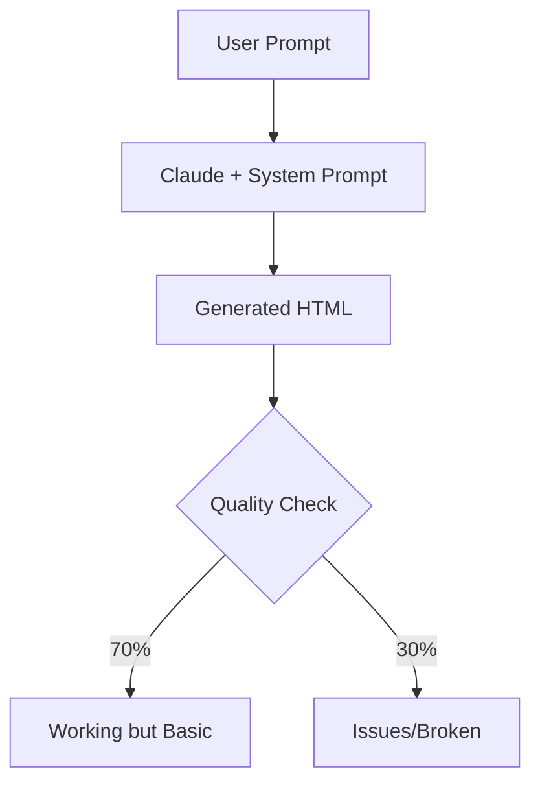
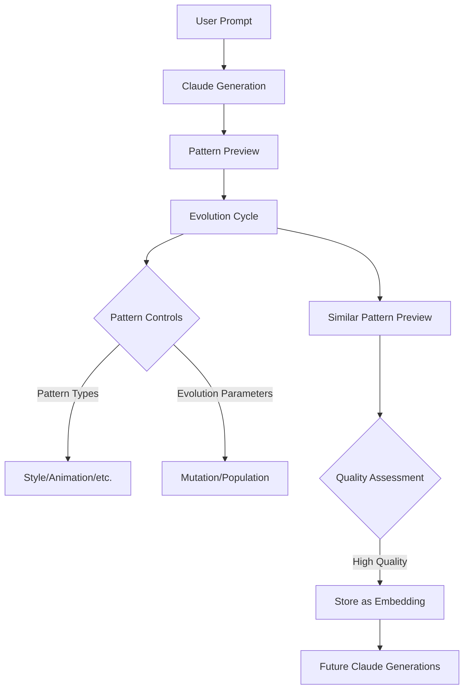
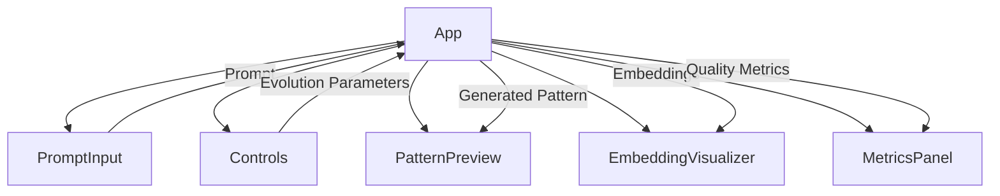
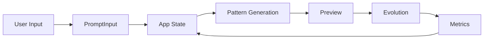

# Artcade Evolution System Planning

## System Overview

### Current Flow



### Enhanced Flow with Evolution



## Core Components

### 1. Pattern Types and Interfaces

```typescript
// Core Pattern Type
// Located at: packages/plugin-artcade/src/types/patterns.ts
interface GamePattern {
    id: string;
    type: string;
    pattern_name: string;
    content: {
        html: string;
        css?: string[];
        javascript?: string[];
        context?: string;
        metadata?: {
            game_mechanics?: Array<{
                type: string;
                properties: Record<string, any>;
            }>;
        };
    };
    embedding: number[];
    effectiveness_score: number;
    usage_count: number;
}

// Generated Pattern Interfaces
// Located at: packages/plugin-artcade/playground/src/shared/types/pattern.types.ts
interface GeneratedPattern {
    plan: PatternPlan;
    title: string;
    description: string;
    html: string;
    thumbnail: PatternThumbnail;
}

// Located at: packages/plugin-artcade/playground/src/shared/types/pattern.types.ts
interface PatternThumbnail {
    alt: string;
    backgroundColor: string;
    elements: Array<{
        type: "rect" | "circle" | "path";
        attributes: Record<string, string>;
    }>;
}

// Located at: packages/plugin-artcade/playground/src/shared/types/pattern.types.ts
interface PatternPlan {
    coreMechanics: string[];
    visualElements: string[];
    interactivity: string[];
    interactionFlow: Array<{
        trigger: string;
        action: string;
        description: string;
    }>;
    stateManagement: {
        variables: Array<{
            name: string;
            type: string;
            description: string;
        }>;
        updates: string[];
    };
    assetRequirements: {
        scripts: string[];
        styles: string[];
        fonts: string[];
        images: string[];
        animations: Array<{
            type: string;
            property: string;
            element: string;
        }>;
    };
}

// Located at: packages/plugin-artcade/src/types/effectiveness.ts
interface PatternEffectivenessMetrics {
    quality_scores: {
        visual: number;
        interactive: number;
        functional: number;
        performance: number;
    };
}

// Located at: packages/plugin-artcade/src/services/PatternEvolution.ts
interface EvolutionOptions {
    mutationRate: number;
    populationSize: number;
}

// Located at: packages/plugin-artcade/playground/src/components/Controls/types.ts
interface EvolutionControls {
    patternType: "style" | "animation" | "interaction" | "game" | "layout";
    evolutionParams: {
        mutationRate: number;
        populationSize: number;
    };
    visualizationMode: "split" | "overlay" | "diff";
    feedbackCategories: {
        visuals: boolean;
        mechanics: boolean;
        interaction: boolean;
        layout: boolean;
    };
}
```

### 2. Service Types

```typescript
// Located at: packages/plugin-artcade/playground/src/services/ClientPatternService.ts
interface ServiceResponse<T> {
    success: boolean;
    data?: T;
    error?: {
        message: string;
        details?: any;
    };
}

// Located at: packages/plugin-artcade/playground/src/services/ClientPatternService.ts
interface ClientPatternService {
    generatePattern(prompt: string): Promise<GeneratedPattern>;
    healthCheck(): Promise<boolean>;
    getAllPatterns(): Promise<GamePattern[]>;
    searchSimilarPatterns(pattern: GamePattern): Promise<GamePattern[]>;
    comparePatterns(
        generatedHtml: string,
        referencePattern: GamePattern,
    ): Promise<PatternEffectivenessMetrics>;
    evolvePattern(
        pattern: GamePattern,
        options: EvolutionOptions,
    ): Promise<GamePattern>;
}

// Located at: packages/plugin-artcade/playground/src/shared/types/pattern.types.ts
class PatternGenerationError extends Error {
    constructor(
        message: string,
        public readonly details?: any,
    ) {
        super(message);
        this.name = "PatternGenerationError";
    }
}

// Located at: packages/plugin-artcade/playground/src/shared/types/pattern.types.ts
class PatternValidationError extends Error {
    constructor(
        message: string,
        public readonly validationErrors: string[],
    ) {
        super(message);
        this.name = "PatternValidationError";
    }
}

// Located at: packages/plugin-artcade/src/services/VectorDatabase.ts
interface VectorSearchResult {
    pattern: GamePattern;
    similarity: number;
}

// Located at: packages/plugin-artcade/src/services/VectorDatabase.ts
class DatabaseError extends Error {
    constructor(
        message: string,
        public readonly cause?: unknown,
    ) {
        super(message);
        this.name = "DatabaseError";
    }
}

// Located at: packages/plugin-artcade/src/services/VectorDatabase.ts
interface AuditLogEntry {
    operation: string;
    pattern_id: string;
    metadata: Record<string, any>;
    performed_at: Date;
}
```

### 3. Component Types

```typescript
// All located at: packages/plugin-artcade/playground/src/components/
interface PatternPreviewProps {
    // Located at: components/PatternPreview/types.ts
    html?: string;
    css?: string[];
    js?: string[];
}

interface EmbeddingVisualizerProps {
    // Located at: components/EmbeddingVisualizer/types.ts
    embeddings: Array<{
        id: string;
        vector: number[];
        label: string;
        type: string;
    }>;
}

interface MetricsPanelProps {
    // Located at: components/MetricsPanel/types.ts
    metrics?: {
        visual: number;
        interactive: number;
        functional: number;
        performance: number;
        accessibility: number;
        codeQuality: number;
    };
}

interface ControlsProps {
    // Located at: components/Controls/types.ts
    selectedPattern: GamePattern | null;
    onEvolve: () => Promise<void>;
    onReset?: () => void;
    onParameterChange: (param: string, value: any) => void;
}
```

## Key Services

### 1. ClientPatternService

Located at: `packages/plugin-artcade/playground/src/services/ClientPatternService.ts`

```typescript
interface ServiceResponse<T> {
    success: boolean;
    data?: T;
    error?: {
        message: string;
        details?: any;
    };
}

interface ClientPatternService {
    generatePattern(prompt: string): Promise<GeneratedPattern>;
    healthCheck(): Promise<boolean>;
    getAllPatterns(): Promise<GamePattern[]>;
    searchSimilarPatterns(pattern: GamePattern): Promise<GamePattern[]>;
    comparePatterns(
        generatedHtml: string,
        referencePattern: GamePattern,
    ): Promise<PatternEffectivenessMetrics>;
    evolvePattern(
        pattern: GamePattern,
        options: EvolutionOptions,
    ): Promise<GamePattern>;
}

class PatternGenerationError extends Error {
    constructor(
        message: string,
        public readonly details?: any,
    ) {
        super(message);
        this.name = "PatternGenerationError";
    }
}

class PatternValidationError extends Error {
    constructor(
        message: string,
        public readonly validationErrors: string[],
    ) {
        super(message);
        this.name = "PatternValidationError";
    }
}
```

### 2. VectorDatabase

Located at: `packages/plugin-artcade/src/services/VectorDatabase.ts`
Primary functions:

- Pattern Storage
- Similarity Search
- Usage Tracking
- Pattern Retrieval
- Effectiveness Scoring

### 3. ClaudeService

Located at: `packages/plugin-artcade/playground/src/server/services/ClaudeService.ts`
Responsibilities:

- Pattern Generation
- Prompt Enhancement
- Pattern Planning
- Quality Assessment

## ClaudeService Implementation

Located at: `packages/plugin-artcade/playground/src/server/services/ClaudeService.ts`

### Core Properties

```typescript
class ClaudeService implements PatternServiceInterface {
    private OPENROUTER_API_KEY: string;
    private readonly API_URL = "https://openrouter.ai/api/v1/chat/completions";
    private readonly PROMPT_TEMPLATE: string;
    private vectorDb: VectorDatabase;
    private lastUsedPatterns: any[] = []; // Track patterns used in generation
}
```

### Constructor

```typescript
constructor(vectorDb: VectorDatabase) {
    // Initializes service with:
    // - OpenRouter API key from config
    // - Prompt template from file system
    // - Vector database instance
}
```

### Public Interface

```typescript
interface PatternServiceInterface {
    generatePattern(prompt: string): Promise<GeneratedPattern>;
}
```

### Private Methods

```typescript
// Pattern Search and Retrieval
private async findRelevantPatterns(prompt: string): Promise<any[]> {
    // Generates embedding for prompt
    // Searches VectorDatabase for similar patterns
    // Returns array of relevant patterns
}

private async generatePrompt(userPrompt: string): Promise<string> {
    // Finds relevant patterns
    // Extracts effective examples
    // Enhances prompt with pattern examples
}

// Pattern Processing
private formatPatternExamples(
    examples: Array<{
        code: string;
        score: number;
        type: string;
    }>
): string {
    // Formats pattern examples for prompt inclusion
}

private extractPlanningInfo(content: string) {
    // Extracts:
    // - Core mechanics
    // - Visual elements
    // - Interactivity
    // - Interaction flow
    // - State management
    // - Asset requirements
}

private convertSvgToElements(svgString: string) {
    // Converts SVG string to structured elements
    // Used for thumbnail generation
}

private extractKeywords(prompt: string): string[] {
    // Extracts relevant keywords from prompt
    // Used for pattern matching and tracking
}
```

### Usage Context Types

```typescript
// Located at: packages/plugin-artcade/playground/src/shared/types/pattern.types.ts
interface ClaudeUsageContext {
    prompt?: string;
    generated_html?: string;
    similarity_score?: number;
    matched_patterns: Array<{
        pattern_id: string;
        similarity: number;
        features_used: string[];
    }>;
    quality_assessment: {
        visual_score: number;
        interactive_score: number;
        functional_score: number;
        performance_score: number;
    };
}
```

### Pattern Generation Flow

1. **Input Processing**

    - Receive user prompt
    - Generate embeddings
    - Find similar patterns

2. **Prompt Enhancement**

    - Format pattern examples
    - Inject successful patterns
    - Apply system prompt template

3. **Generation**

    - Call OpenRouter API
    - Process Claude's response
    - Extract planning information

4. **Post-Processing**
    - Convert SVG elements
    - Track pattern usage
    - Update effectiveness metrics

### Error Handling

```typescript
try {
    // Pattern generation steps
} catch (error) {
    throw new PatternGenerationError(
        "Failed to generate pattern",
        error instanceof Error ? error.message : error,
    );
}
```

## Frontend Components

### 1. Main App Structure

Located at: `packages/plugin-artcade/playground/src/App.tsx`

```typescript
// Core State Types
interface AppState {
    patterns: GamePattern[];
    selectedPattern: GamePattern | null;
    claudeOutput: GeneratedPattern | null;
    metrics: PatternEffectivenessMetrics | null;
    loading: boolean;
}

// Claude Output Type
type ClaudeOutput = {
    plan: {
        coreMechanics: string[];
        visualElements: string[];
        interactionFlow: string[];
        stateManagement: string[];
        assetRequirements: string[];
    };
    title: string;
    description: string;
    html: string;
    thumbnail: {
        alt: string;
        backgroundColor: string;
        elements: Array<{
            type: "rect" | "circle" | "path";
            attributes: Record<string, string>;
        }>;
    };
} | null;

// Event Handler Types
interface AppHandlers {
    handlePromptSubmit: (prompt: string) => Promise<void>;
    handleEvolvePattern: () => Promise<void>;
}

// Component Props
interface PromptInputProps {
    onSubmit: (prompt: string) => Promise<void>;
    loading: boolean;
}

interface PatternPreviewProps {
    html?: string;
    css?: string[];
    js?: string[];
}

interface EmbeddingVisualizerProps {
    embeddings: Array<{
        id: string;
        vector: number[];
        label: string;
        type: string;
    }>;
}

interface MetricsPanelProps {
    metrics?: {
        visual: number;
        interactive: number;
        functional: number;
        performance: number;
        accessibility: number;
        codeQuality: number;
    };
}

interface ControlsProps {
    selectedPattern: GamePattern | null;
    onEvolve: () => Promise<void>;
    onReset?: () => void;
    onParameterChange: (param: string, value: any) => void;
    loading?: boolean; // Optional loading state
}
```

### 2. Effect Hooks and Dependencies

```typescript
// Initial Pattern Loading
useEffect(() => {
    console.log("Initial useEffect running");
    const initializePatterns = async () => {
        console.log("Initializing patterns");
        const isHealthy = await clientPatternService.healthCheck();
        if (!isHealthy) {
            console.error("Pattern service health check failed");
            return;
        }
        const loadedPatterns = await clientPatternService.getAllPatterns();
        console.log("Loaded patterns:", loadedPatterns);
        setPatterns(loadedPatterns);
        if (loadedPatterns.length > 0) {
            setSelectedPattern(loadedPatterns[0]);
        }
    };
    initializePatterns();
}, []); // Empty dependency array - runs once on mount

// Pattern Change Tracking
useEffect(() => {
    console.log("Selected pattern changed:", selectedPattern);
}, [selectedPattern]);

// Claude Output Monitoring
useEffect(() => {
    console.log("Claude output changed:", claudeOutput);
}, [claudeOutput]);

// Metrics Update Tracking
useEffect(() => {
    console.log("Metrics changed:", metrics);
}, [metrics]);
```

### 3. Core Event Handlers

```typescript
// Prompt Submission Handler
const handlePromptSubmit = async (prompt: string) => {
    setLoading(true);
    try {
        const generatedPattern =
            await clientPatternService.generatePattern(prompt);
        setClaudeOutput(generatedPattern);

        if (patterns.length > 0) {
            const generatedGamePattern: GamePattern = {
                id: "generated",
                type: "game_mechanic",
                pattern_name: generatedPattern.title,
                content: {
                    html: generatedPattern.html,
                    context: "game",
                    metadata: {
                        game_mechanics: generatedPattern.plan.coreMechanics.map(
                            (mechanic) => ({
                                type: mechanic,
                                properties: {},
                            }),
                        ),
                    },
                },
                embedding: [],
                effectiveness_score: 1.0,
                usage_count: 0,
            };

            const similarPatterns =
                await clientPatternService.searchSimilarPatterns(
                    generatedGamePattern,
                );
            if (similarPatterns.length > 0) {
                setSelectedPattern(similarPatterns[0]);
                const metrics = await clientPatternService.comparePatterns(
                    generatedPattern.html,
                    similarPatterns[0],
                );
                setMetrics(metrics);
            }
        }
    } catch (error) {
        console.error("Error processing prompt:", error);
    } finally {
        setLoading(false);
    }
};

// Evolution Handler
const handleEvolvePattern = async () => {
    if (!claudeOutput) return;
    setLoading(true);
    try {
        const currentPattern: GamePattern = {
            id: "current",
            type: selectedPattern?.type || "game_mechanic",
            pattern_name: claudeOutput.title,
            content: {
                html: claudeOutput.html,
                context: "game",
                metadata: {
                    game_mechanics: claudeOutput.plan.coreMechanics.map(
                        (mechanic) => ({
                            type: mechanic,
                            properties: {},
                        }),
                    ),
                },
            },
            embedding: [],
            effectiveness_score: 1.0,
            usage_count: 0,
        };

        const evolvedPattern = await clientPatternService.evolvePattern(
            currentPattern,
            {
                mutationRate: 0.3,
                populationSize: 10,
            },
        );

        setClaudeOutput({
            ...claudeOutput,
            html: evolvedPattern.content.html,
        });

        const similarPatterns =
            await clientPatternService.searchSimilarPatterns(evolvedPattern);
        if (similarPatterns.length > 0) {
            setSelectedPattern(similarPatterns[0]);
            const metrics = await clientPatternService.comparePatterns(
                evolvedPattern.content.html,
                similarPatterns[0],
            );
            setMetrics(metrics);
        }
    } catch (error) {
        console.error("Error evolving pattern:", error);
    } finally {
        setLoading(false);
    }
};
```

## Evolution Strategy

### Phase 1: Initial Generation

1. User provides prompt
2. Claude generates initial pattern
3. Pattern displayed in preview

### Phase 2: Evolution

1. Select pattern type focus
2. Set evolution parameters
3. System injects relevant embeddings
4. New pattern generated with improvements

### Phase 3: Quality Assessment

1. Compare original vs evolved
2. Collect structured feedback
3. Store high-quality patterns
4. Update effectiveness metrics

## Next Steps

1. [ ] Implement missing ClientPatternService methods
2. [ ] Create structured feedback collection
3. [ ] Design evolution visualization system
4. [ ] Set up embedding injection strategy
5. [ ] Implement pattern type filtering
6. [ ] Add quality metrics tracking

## Notes

- Only store verified, high-quality patterns as embeddings
- Human verification required for embedding storage
- Focus on gradual improvement of pattern library
- Maintain type safety throughout the system
- Consider edge cases in evolution process

## Component Implementation Details

### 1. Controls Component

Located at: `packages/plugin-artcade/playground/src/components/Controls.tsx`

```typescript
interface ControlsProps {
    onEvolve?: () => void;
    onReset?: () => void;
    onParameterChange?: (param: string, value: any) => void;
    selectedPattern?: GamePattern | null;
}

// Pattern Type Constants
const patternTypes = [
    'animation',
    'layout',
    'interaction',
    'style',
    'game_mechanic'
] as const;

// Component Structure
- Pattern Type Selection (Select)
- Evolution Parameters
  - Mutation Rate (Slider: 0-1)
  - Population Size (Slider: 5-50)
- Action Buttons
  - Evolve Pattern
  - Reset

// Grid Layout
<Grid container spacing={3}>
    <Grid item xs={12}> {/* Pattern Type Selection */}
    <Grid item xs={12}> {/* Evolution Parameters */}
    <Grid item xs={6}>  {/* Action Buttons */}
</Grid>
```

### 2. EmbeddingVisualizer Component

Located at: `packages/plugin-artcade/playground/src/components/EmbeddingVisualizer.tsx`

```typescript
interface EmbeddingVisualizerProps {
    embeddings?: Array<{
        id: string;
        vector: number[];
        label: string;
        type: string;
    }>;
}

// Visualization Configuration
const plotConfig = {
    type: "scatter",
    mode: "markers+text",
    textposition: "top center",
    marker: { size: 10 },
};

// Layout Configuration
const layoutConfig = {
    autosize: true,
    showlegend: true,
    paper_bgcolor: "rgba(0,0,0,0)",
    plot_bgcolor: "rgba(0,0,0,0)",
    margin: { t: 0, r: 0, b: 30, l: 30 },
    xaxis: {
        showgrid: true,
        zeroline: true,
        showline: true,
        gridcolor: "rgba(255,255,255,0.1)",
        zerolinecolor: "rgba(255,255,255,0.2)",
    },
    yaxis: {
        showgrid: true,
        zeroline: true,
        showline: true,
        gridcolor: "rgba(255,255,255,0.1)",
        zerolinecolor: "rgba(255,255,255,0.2)",
    },
    font: {
        color: "#fff",
    },
};
```

### 3. MetricsPanel Component

Located at: `packages/plugin-artcade/playground/src/components/MetricsPanel.tsx`

```typescript
interface MetricsPanelProps {
    metrics?: {
        visual: number;
        interactive: number;
        functional: number;
        performance: number;
        accessibility: number;
        codeQuality: number;
    };
}

// Radar Chart Configuration
const radarConfig = {
    type: "scatterpolar",
    fill: "toself",
    name: "Pattern Metrics",
};

// Layout Configuration
const layoutConfig = {
    polar: {
        radialaxis: {
            visible: true,
            range: [0, 1],
        },
    },
    showlegend: false,
    paper_bgcolor: "rgba(0,0,0,0)",
    plot_bgcolor: "rgba(0,0,0,0)",
    margin: { t: 0, r: 0, b: 0, l: 0 },
    font: {
        color: "#fff",
    },
};

// Metric Categories
const metricCategories = [
    "Visual",
    "Interactive",
    "Functional",
    "Performance",
    "Accessibility",
    "Code Quality",
];
```

### 4. PatternPreview Component

Located at: `packages/plugin-artcade/playground/src/components/PatternPreview.tsx`

```typescript
interface PatternPreviewProps {
    html?: string;
    css?: string;
    js?: string;
}

// IFrame Configuration
const iframeConfig = {
    sandbox: "allow-scripts allow-same-origin",
    style: {
        width: "100%",
        height: "100%",
        border: "none",
        backgroundColor: "white",
        position: "absolute",
        top: 0,
        left: 0,
    },
};

// Container Styles
const containerStyles = {
    flexGrow: 1,
    border: "1px solid rgba(255, 255, 255, 0.12)",
    borderRadius: 1,
    overflow: "hidden",
    height: "800px",
    maxHeight: "800px",
    maxWidth: "100%",
    position: "relative",
};

// Default CSS Injection
const defaultStyles = `
    html, body {
        margin: 0;
        padding: 0;
        width: 100%;
        height: 100%;
        overflow: auto;
    }
    #game-container {
        width: 100%;
        height: 100%;
        position: relative;
        overflow: hidden;
    }
`;

// Document Template
const documentTemplate = `
    <!DOCTYPE html>
    <html>
        <head>
            <style>${defaultStyles}${css}</style>
        </head>
        <body>
            <div id="game-container">${html}</div>
            <script>${js}</script>
        </body>
    </html>
`;
```

### 5. PromptInput Component

Located at: `packages/plugin-artcade/playground/src/components/PromptInput.tsx`

```typescript
interface PromptInputProps {
    onSubmit: (prompt: string) => void;
    loading?: boolean;
}

// Component State
const [prompt, setPrompt] = useState('');

// Form Configuration
const formConfig = {
    TextField: {
        fullWidth: true,
        multiline: true,
        rows: 3,
        variant: "outlined",
        placeholder: "Describe the HTML experience you want to create..."
    },
    SubmitButton: {
        type: "submit",
        variant: "contained",
        endIcon: loading ? <CircularProgress size={20} /> : null
    }
};

// Example Prompts
const examplePrompt = "Create a car racing game with score tracking and power-ups";

// Form Validation
const isValid = (prompt: string): boolean => {
    return prompt.trim().length > 0 && !loading;
};

// Event Handlers
const handleSubmit = (e: React.FormEvent) => {
    e.preventDefault();
    if (isValid(prompt)) {
        onSubmit(prompt.trim());
    }
};
```

### Component Relationships



### State Flow


