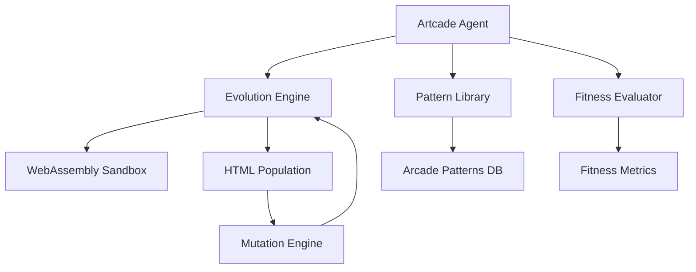

# Artcade - HTML Evolution Through Arcade Mechanics

## Product Requirements Document

### Overview

Artcade is an autonomous AI agent built on the Eliza framework that evolves HTML files into interactive experiences using principles from classic arcade games. It combines evolutionary algorithms, WebAssembly-based testing, and arcade game patterns to enhance user-generated content.

### System Architecture



### Core Components

#### 1. Evolution Engine (`packages/plugin-artcade/src/evolution/`)

- Manages HTML organism population
- Implements genetic algorithms
- Handles code mutation and crossover
- Tracks evolutionary history

Required Dependencies:

```typescript
// packages/plugin-artcade/package.json
{
    "dependencies": {
        "@ai16z/eliza": "workspace:*",
        "wasm-pack": "^0.10.0",
        "genetic-js": "^0.5.0",
        "esprima": "^4.0.1"  // For AST manipulation
    }
}
```

#### 2. Pattern Library (`packages/plugin-artcade/src/patterns/`)

Arcade mechanics database storing:

- Movement patterns (Pac-Man, Space Invaders)
- Interaction models (Breakout, Tetris)
- Scoring systems
- Progressive difficulty curves

Database Schema:

```sql
CREATE TABLE arcade_patterns (
    id UUID PRIMARY KEY,
    name TEXT NOT NULL,
    source_game TEXT NOT NULL,
    pattern_type TEXT NOT NULL,
    code_template TEXT NOT NULL,
    fitness_score FLOAT,
    usage_count INTEGER,
    embedding vector(1536)
);
```

#### 3. WebAssembly Testing Environment (`packages/plugin-artcade/src/wasm/`)

- Secure sandbox for evolved code
- Performance metrics collection
- Interaction simulation
- Memory usage monitoring

#### 4. Fitness Evaluation System (`packages/plugin-artcade/src/fitness/`)

Metrics:

- Interactivity score
- Code complexity
- Performance metrics
- Entertainment value
- Novel pattern usage

### Implementation Strategy

#### Phase 1: Core Infrastructure

1. **Plugin Setup**

```typescript
// packages/plugin-artcade/src/index.ts
import { Plugin } from "@ai16z/eliza";
import { EvolutionEngine } from "./evolution";
import { PatternLibrary } from "./patterns";
import { WasmTester } from "./wasm";
import { FitnessEvaluator } from "./fitness";

export const artcadePlugin: Plugin = {
    name: "artcade",
    description: "HTML evolution through arcade mechanics",
    actions: [evolveHtmlAction, mutateCodeAction, evaluateFitnessAction],
    evaluators: [arcadeFitnessEvaluator, patternMatchEvaluator],
    providers: [arcadePatternProvider],
    services: [wasmTestingService],
};
```

2. **Character Configuration**

```typescript
// packages/plugin-artcade/src/character.ts
export const artcadeCharacter = {
    name: "Artcade",
    bio: "HTML evolution specialist using arcade game principles",
    modelProvider: ModelProviderName.GPT4,
    settings: {
        temperature: 0.8,
        maxTokens: 2048,
    },
    plugins: ["@ai16z/plugin-artcade", "@ai16z/plugin-bootstrap"],
    examples: [
        // Evolution examples
    ],
};
```

#### Phase 2: Evolution Engine (see detailed implementation plan below)

#### Phase 3: Testing & Evaluation Infrastructure

1. **Core Testing Architecture**

````typescript
// packages/plugin-artcade/src/testing/core/index.ts
import { IAgentRuntime, Memory, PluginContext } from "@ai16z/eliza";
import { TestResults, TestEnvironment } from "../types";

export class TestingCore {
    private runtime: IAgentRuntime;
    private memoryManager: TestMemoryManager;
    private eventEmitter: TestEventEmitter;

    constructor(runtime: IAgentRuntime) {
        this.runtime = runtime;
        this.memoryManager = new TestMemoryManager(runtime);
        this.eventEmitter = new TestEventEmitter(runtime);
    }

    async initialize(context: PluginContext): Promise<void> {
        // Register test-specific memory types
        await this.memoryManager.registerTypes();

        // Initialize event handlers
        await this.eventEmitter.initialize();

        // Register testing commands
        await this.runtime.commandRegistry.register([
            {
                name: "run_evolution_tests",
                description: "Execute test suite for evolved HTML",
                handler: this.handleTestExecution.bind(this),
            },
            {
                name: "analyze_test_results",
                description: "Analyze test results and pattern effectiveness",
                handler: this.handleResultAnalysis.bind(this),
            },
        ]);
    }

    async runTestSuite(organism: HTMLOrganism): Promise<TestResults> {
        // 1. Create test environment
        const environment = await this.createTestEnvironment();

        // 2. Emit test start event
        await this.eventEmitter.emit("test_suite_started", {
            organismId: organism.id,
            generation: organism.generation,
            timestamp: new Date().toISOString(),
        });

        try {
            // 3. Execute tests
            const results = await environment.executeTests(organism);

            // 4. Store results in Eliza's memory system
            await this.memoryManager.storeTestResults(organism, results);

            // 5. Update pattern effectiveness metrics
            await this.updatePatternMetrics(organism, results);

            // 6. Emit test completion event
            await this.eventEmitter.emit("test_suite_completed", {
                organismId: organism.id,
                results,
                timestamp: new Date().toISOString(),
            });

            return results;
        } catch (error) {
            // Handle and store test failures
            await this.handleTestFailure(organism, error);
            throw error;
        }
    }

    private async createTestEnvironment(): Promise<TestEnvironment> {
        return {
            sandbox: await this.initializeSandbox(),
            metrics: new MetricsCollector(this.runtime),
            simulation: new InteractionSimulator(this.runtime),
        };
    }

    private async updatePatternMetrics(
        organism: HTMLOrganism,
        results: TestResults,
    ): Promise<void> {
        // Update effectiveness scores for applied patterns
        await Promise.all(
            organism.appliedPatterns.map(async (patternId) => {
                const pattern = await this.memoryManager.getPattern(patternId);
                const effectiveness = this.calculatePatternEffectiveness(
                    pattern,
                    results,
                );

                await this.memoryManager.updatePatternEffectiveness(
                    patternId,
                    effectiveness,
                );
            }),
        );
    }
}

2. **Test Memory Integration**

```typescript
// packages/plugin-artcade/src/testing/memory/index.ts
import { IAgentRuntime, Memory, MemoryType } from "@ai16z/eliza";

export class TestMemoryManager {
    constructor(private runtime: IAgentRuntime) {}

    async registerTypes(): Promise<void> {
        await this.runtime.memoryManager.registerTypes([
            {
                name: "test_result",
                schema: TestResultSchema,
                indexFields: [
                    "organismId",
                    "generation",
                    "performance.fps",
                    "interactions.total",
                    "errors.length",
                ],
            },
            {
                name: "test_metrics",
                schema: TestMetricsSchema,
                indexFields: [
                    "patternId",
                    "effectiveness",
                    "usageCount",
                    "timestamp",
                ],
            },
            {
                name: "test_relationship",
                schema: TestRelationshipSchema,
                indexFields: ["fromId", "toId", "type", "strength"],
            },
        ]);
    }

    async storeTestResults(
        organism: HTMLOrganism,
        results: TestResults,
    ): Promise<void> {
        // Create test result memory
        const resultMemory = await this.runtime.memoryManager.createMemory({
            type: "test_result",
            content: {
                organism,
                results,
                timestamp: new Date().toISOString(),
            },
            metadata: {
                organismId: organism.id,
                generation: organism.generation,
                performance: results.performance,
                interactionScore: results.interactions.total,
                errorCount: results.errors.length,
            },
        });

        // Create relationships with parent test results
        if (organism.parentIds.length > 0) {
            const parentResults = await this.getParentTestResults(
                organism.parentIds,
            );
            await this.createTestRelationships(resultMemory.id, parentResults);
        }
    }

    async getPattern(patternId: string): Promise<ArcadePattern> {
        const pattern = await this.runtime.memoryManager.getMemory({
            id: patternId,
            tableName: "arcade_patterns",
        });
        return pattern.content as ArcadePattern;
    }

    async updatePatternEffectiveness(
        patternId: string,
        effectiveness: number,
    ): Promise<void> {
        await this.runtime.memoryManager.createMemory({
            type: "test_metrics",
            content: {
                patternId,
                effectiveness,
                timestamp: new Date().toISOString(),
            },
            metadata: {
                patternId,
                effectiveness,
                timestamp: new Date().toISOString(),
            },
        });
    }

    private async createTestRelationships(
        resultId: string,
        parentResults: Memory[],
    ): Promise<void> {
        await Promise.all(
            parentResults.map((parent) =>
                this.runtime.memoryManager.createRelationship({
                    fromId: resultId,
                    toId: parent.id,
                    type: "evolved_from",
                    metadata: {
                        strength: this.calculateRelationshipStrength(parent),
                    },
                }),
            ),
        );
    }
}
````

3. **Test Environment Implementation**

```typescript
// packages/plugin-artcade/src/testing/environment/index.ts
import { TestEnvironment, TestResults } from "../types";
import { WasmSandbox } from "./sandbox";
import { MetricsCollector } from "./metrics";
import { InteractionSimulator } from "./simulation";

export class TestEnvironmentManager {
    private runtime: IAgentRuntime;

    constructor(runtime: IAgentRuntime) {
        this.runtime = runtime;
    }

    async createEnvironment(): Promise<TestEnvironment> {
        const sandbox = await this.initializeSandbox();
        const metrics = await this.initializeMetrics();
        const simulation = await this.initializeSimulation();

        return { sandbox, metrics, simulation };
    }

    private async initializeSandbox(): Promise<WasmSandbox> {
        const sandbox = new WasmSandbox({
            memoryLimit: process.env.WASM_MEMORY_LIMIT || "512M",
            timeout: parseInt(process.env.WASM_TIMEOUT || "5000"),
            allowedApis: ["DOM", "requestAnimationFrame", "setTimeout"],
        });

        await sandbox.initialize();
        return sandbox;
    }

    private async initializeMetrics(): Promise<MetricsCollector> {
        return new MetricsCollector(this.runtime, {
            sampleRate: 60,
            bufferSize: 1000,
            aggregationInterval: 100,
        });
    }

    private async initializeSimulation(): Promise<InteractionSimulator> {
        return new InteractionSimulator(this.runtime, {
            eventTypes: ["click", "drag", "keyboard", "gesture"],
            simulationDuration: 5000,
            concurrent: true,
        });
    }
}
```

4. **Test Execution and Analysis**

```typescript
// packages/plugin-artcade/src/testing/execution/index.ts
export class TestExecutor {
    private runtime: IAgentRuntime;
    private environment: TestEnvironment;

    constructor(runtime: IAgentRuntime, environment: TestEnvironment) {
        this.runtime = runtime;
        this.environment = environment;
    }

    async executeTests(organism: HTMLOrganism): Promise<TestResults> {
        // 1. Performance Testing
        const performanceResults = await this.testPerformance(organism);

        // 2. Interaction Testing
        const interactionResults = await this.testInteractions(organism);

        // 3. Accessibility Testing
        const accessibilityResults = await this.testAccessibility(organism);

        // 4. Pattern Effectiveness
        const patternResults = await this.testPatterns(organism);

        // 5. Aggregate Results
        return this.aggregateResults({
            performance: performanceResults,
            interactions: interactionResults,
            accessibility: accessibilityResults,
            patterns: patternResults,
        });
    }

    private async testPerformance(
        organism: HTMLOrganism,
    ): Promise<PerformanceResults> {
        const { sandbox, metrics } = this.environment;

        // Load organism in sandbox
        await sandbox.load(organism.code);

        // Collect metrics
        return await metrics.collectPerformanceMetrics({
            duration: 5000,
            samples: 300,
        });
    }

    private async testInteractions(
        organism: HTMLOrganism,
    ): Promise<InteractionResults> {
        const { simulation } = this.environment;

        // Run interaction simulations
        return await simulation.runInteractionTests({
            scenarios: this.generateTestScenarios(organism),
            timeout: 10000,
        });
    }

    private async testAccessibility(
        organism: HTMLOrganism,
    ): Promise<AccessibilityResults> {
        // Implement accessibility testing
    }

    private async testPatterns(
        organism: HTMLOrganism,
    ): Promise<PatternResults> {
        // Implement pattern effectiveness testing
    }
}
```

5. **Monitoring and Reporting**

```typescript
// packages/plugin-artcade/src/testing/monitoring/index.ts
export class TestMonitor {
    private runtime: IAgentRuntime;
    private metrics: Map<string, MetricSeries>;
    private alerts: AlertManager;

    constructor(runtime: IAgentRuntime) {
        this.runtime = runtime;
        this.metrics = new Map();
        this.alerts = new AlertManager(runtime);
    }

    async initialize(): Promise<void> {
        // Setup Prometheus metrics
        await this.setupMetrics();

        // Initialize alerting
        await this.alerts.initialize();

        // Setup monitoring dashboards
        await this.setupDashboards();
    }

    private async setupMetrics(): Promise<void> {
        // Register custom metrics
        this.registerMetric("evolution_generation_time", "histogram");
        this.registerMetric("population_fitness_avg", "gauge");
        this.registerMetric("pattern_application_success_rate", "gauge");
        this.registerMetric("test_execution_time", "histogram");
        this.registerMetric("sandbox_memory_usage", "gauge");
        this.registerMetric("interaction_simulation_success_rate", "gauge");
    }

    private async setupDashboards(): Promise<void> {
        // Create Grafana dashboards
        await this.createDashboard("Evolution Performance", {
            metrics: [
                "evolution_generation_time",
                "population_fitness_avg",
                "pattern_application_success_rate",
            ],
            refresh: "10s",
            timeRange: "1h",
        });

        await this.createDashboard("Test Performance", {
            metrics: [
                "test_execution_time",
                "sandbox_memory_usage",
                "interaction_simulation_success_rate",
            ],
            refresh: "10s",
            timeRange: "1h",
        });
    }
}
```

6. **Integration Testing**

```typescript
// packages/plugin-artcade/src/testing/__tests__/integration.test.ts
import { describe, it, expect } from "vitest";
import { TestingCore } from "../core";
import { MockRuntime } from "@ai16z/eliza/testing";

describe("Testing System Integration", () => {
    let runtime: MockRuntime;
    let testingCore: TestingCore;

    beforeEach(async () => {
        runtime = new MockRuntime();
        testingCore = new TestingCore(runtime);
        await testingCore.initialize({} as PluginContext);
    });

    it("should execute full test suite", async () => {
        const organism: HTMLOrganism = {
            id: "test-1",
            code: "<div>Test</div>",
            generation: 1,
            fitness: { total: 0 },
            parentIds: [],
            appliedPatterns: [],
        };

        const results = await testingCore.runTestSuite(organism);

        expect(results.performance.fps).toBeGreaterThan(30);
        expect(results.interactions.total).toBeGreaterThan(0);
        expect(results.errors).toHaveLength(0);
    });

    it("should store test results in memory", async () => {
        const organism = createTestOrganism();
        await testingCore.runTestSuite(organism);

        const storedResults = await runtime.memoryManager.searchMemories({
            tableName: "test_results",
            filter: { organismId: organism.id },
        });

        expect(storedResults).toHaveLength(1);
        expect(storedResults[0].content.organism.id).toBe(organism.id);
    });

    it("should update pattern effectiveness", async () => {
        const organism = createTestOrganism();
        const pattern = await createTestPattern(runtime);
        organism.appliedPatterns = [pattern.id];

        await testingCore.runTestSuite(organism);

        const updatedPattern = await runtime.memoryManager.getMemory({
            id: pattern.id,
            tableName: "arcade_patterns",
        });

        expect(updatedPattern.content.effectiveness).toBeGreaterThan(0);
    });
});
```

7. **Documentation**

````markdown
# Testing System Documentation

## Overview

The testing system provides comprehensive evaluation of evolved HTML organisms,
integrating deeply with Eliza's memory and runtime systems.

## Components

1. **Core Testing System**

    - Test execution orchestration
    - Memory integration
    - Event handling
    - Command registration

2. **Test Environment**

    - WebAssembly sandbox
    - Metrics collection
    - Interaction simulation
    - Resource management

3. **Memory Integration**

    - Test result storage
    - Pattern effectiveness tracking
    - Relationship management
    - Historical analysis

4. **Monitoring**
    - Real-time metrics
    - Performance tracking
    - Alert management
    - Dashboard visualization

## Usage

```typescript
// Initialize testing system
const testingCore = new TestingCore(runtime);
await testingCore.initialize(context);

// Run tests
const results = await testingCore.runTestSuite(organism);

// Analyze results
const analysis = await testingCore.analyzeResults(results);
```
````

## Integration Points

1. **Memory System**

    - Test results storage
    - Pattern effectiveness tracking
    - Evolution history
    - Relationship mapping

2. **Runtime System**

    - Command registration
    - Event handling
    - Resource management
    - Error handling

3. **Monitoring System**
    - Metrics collection
    - Performance tracking
    - Alert management
    - Dashboard visualization

````

### Integration with Eliza

1. **Memory System Integration**

```typescript
// packages/plugin-artcade/src/memory/index.ts
import { IAgentRuntime, Memory, MemoryType } from "@ai16z/eliza";
import { ArcadePattern, HTMLOrganism, TestResults } from "../types";

export class ArcadeMemoryManager {
    constructor(private runtime: IAgentRuntime) {}

    async initialize(): Promise<void> {
        // Register custom memory types
        await this.runtime.memoryManager.registerTypes([
            {
                name: "arcade_pattern",
                schema: ArcadePatternSchema,
                indexFields: ["sourceGame", "patternType", "fitnessScore"],
            },
            {
                name: "evolution_result",
                schema: EvolutionResultSchema,
                indexFields: ["generation", "fitness.total"],
            },
            {
                name: "test_result",
                schema: TestResultSchema,
                indexFields: ["performance.fps", "errors.length"],
            },
        ]);
    }

    async storePattern(pattern: ArcadePattern): Promise<void> {
        const embedding = await this.runtime.embedder.embed(
            `${pattern.name} ${pattern.description} ${pattern.sourceGame}`,
        );

        await this.runtime.memoryManager.createMemory({
            type: "arcade_pattern",
            content: pattern,
            embedding,
            metadata: {
                sourceGame: pattern.sourceGame,
                patternType: pattern.patternType,
                fitnessScore: pattern.fitnessScore,
            },
        });
    }

    async findSimilarPatterns(
        description: string,
        limit: number = 10,
    ): Promise<ArcadePattern[]> {
        const embedding = await this.runtime.embedder.embed(description);
        const memories =
            await this.runtime.memoryManager.searchMemoriesByEmbedding({
                embedding,
                tableName: "arcade_patterns",
                limit,
                minSimilarity: 0.7,
            });

        return memories.map((m) => m.content as ArcadePattern);
    }

    async storeEvolutionResult(
        organism: HTMLOrganism,
        testResults: TestResults,
    ): Promise<void> {
        const evolutionMemory = await this.runtime.memoryManager.createMemory({
            type: "evolution_result",
            content: {
                organism,
                testResults,
                timestamp: new Date().toISOString(),
            },
            metadata: {
                generation: organism.generation,
                fitness: organism.fitness,
            },
        });

        // Create relationships with parent organisms
        await Promise.all(
            organism.parentIds.map((parentId) =>
                this.runtime.memoryManager.createRelationship({
                    fromId: evolutionMemory.id,
                    toId: parentId,
                    type: "evolved_from",
                }),
            ),
        );
    }

    async getEvolutionHistory(
        startGeneration: number,
        endGeneration: number,
    ): Promise<HTMLOrganism[]> {
        const memories = await this.runtime.memoryManager.searchMemories({
            tableName: "evolution_results",
            filter: {
                generation: {
                    gte: startGeneration,
                    lte: endGeneration,
                },
            },
            sort: { generation: "asc" },
        });

        return memories.map((m) => (m.content as any).organism as HTMLOrganism);
    }
}
````

2. **Action System Integration**

```typescript
// packages/plugin-artcade/src/actions/index.ts
const evolveHtmlAction: Action = {
    name: "EVOLVE_HTML",
    handler: async (runtime: IAgentRuntime, message: Memory) => {
        // Evolution action implementation
    },
};
```

### Deployment Requirements

1. **Infrastructure Requirements**

```yaml
# infrastructure/docker-compose.yml
version: "3.8"
services:
    database:
        image: postgres:15-alpine
        environment:
            POSTGRES_DB: artcade
            POSTGRES_USER: artcade
            POSTGRES_PASSWORD: ${DB_PASSWORD}
        volumes:
            - pgdata:/var/lib/postgresql/data
        ports:
            - "5432:5432"
        command:
            - "postgres"
            - "-c"
            - "shared_preload_libraries=pg_vector"

    redis:
        image: redis:7-alpine
        ports:
            - "6379:6379"
        volumes:
            - redisdata:/data

    wasm-sandbox:
        build:
            context: ./packages/plugin-artcade/wasm
            dockerfile: Dockerfile
        ports:
            - "8080:8080"
        environment:
            NODE_ENV: production
            MEMORY_LIMIT: 512M

volumes:
    pgdata:
    redisdata:
```

2. **System Requirements**

```bash
# Required system specifications
CPU: Intel/AMD x64 with AVX2 support
Memory: 4GB minimum, 8GB recommended
Storage: 20GB SSD minimum
OS: Ubuntu 20.04 LTS or newer
Network: 100Mbps minimum, 1Gbps recommended
GPU: Optional - NVIDIA with CUDA support for parallel evolution
```

3. **Database Configuration**

```sql
-- Required PostgreSQL extensions and tables
CREATE EXTENSION IF NOT EXISTS vector;
CREATE EXTENSION IF NOT EXISTS pgcrypto;

-- Pattern storage with vector search
CREATE TABLE arcade_patterns (
    id UUID PRIMARY KEY DEFAULT gen_random_uuid(),
    name TEXT NOT NULL,
    source_game TEXT NOT NULL,
    pattern_type TEXT NOT NULL,
    code_template TEXT NOT NULL,
    fitness_score FLOAT NOT NULL DEFAULT 0.0,
    usage_count INTEGER NOT NULL DEFAULT 0,
    embedding vector(1536) NOT NULL,
    created_at TIMESTAMP WITH TIME ZONE DEFAULT CURRENT_TIMESTAMP,
    updated_at TIMESTAMP WITH TIME ZONE DEFAULT CURRENT_TIMESTAMP,
    CONSTRAINT valid_fitness CHECK (fitness_score >= 0.0 AND fitness_score <= 1.0)
);

-- Evolution history tracking
CREATE TABLE evolution_history (
    id UUID PRIMARY KEY DEFAULT gen_random_uuid(),
    organism_id UUID NOT NULL,
    generation INTEGER NOT NULL,
    parent_ids UUID[] NOT NULL,
    fitness_score FLOAT NOT NULL,
    code TEXT NOT NULL,
    applied_patterns UUID[] NOT NULL,
    created_at TIMESTAMP WITH TIME ZONE DEFAULT CURRENT_TIMESTAMP,
    CONSTRAINT valid_generation CHECK (generation >= 0)
);

-- Indexes for performance
CREATE INDEX idx_patterns_embedding ON arcade_patterns USING ivfflat (embedding vector_cosine_ops);
CREATE INDEX idx_patterns_fitness ON arcade_patterns (fitness_score DESC);
CREATE INDEX idx_evolution_generation ON evolution_history (generation);
```

4. **Environment Variables**

```bash
# .env.production
# Database
DB_HOST=localhost
DB_PORT=5432
DB_NAME=artcade
DB_USER=artcade
DB_PASSWORD=secure_password_here
DB_POOL_SIZE=20

# Redis
REDIS_HOST=localhost
REDIS_PORT=6379
REDIS_PASSWORD=secure_password_here

# WASM Sandbox
WASM_SANDBOX_URL=http://localhost:8080
WASM_SANDBOX_TOKEN=secure_token_here
WASM_MEMORY_LIMIT=512M
WASM_TIMEOUT=5000

# Eliza Integration
ELIZA_API_VERSION=v1
ELIZA_MEMORY_TABLE=artcade_memories
ELIZA_PATTERN_TABLE=arcade_patterns
ELIZA_MAX_GENERATIONS=50
ELIZA_POPULATION_SIZE=100

# Performance Tuning
EVOLUTION_THREAD_POOL=4
PATTERN_CACHE_SIZE=1000
MEMORY_CACHE_TTL=3600
```

5. **Monitoring Setup**

```yaml
# monitoring/prometheus.yml
global:
  scrape_interval: 15s

scrape_configs:
  - job_name: 'artcade'
    static_configs:
      - targets: ['localhost:9090']
    metrics_path: '/metrics'
    scheme: 'http'

# monitoring/grafana-dashboards/artcade.json
{
  "dashboard": {
    "panels": [
      {
        "title": "Evolution Performance",
        "metrics": [
          "evolution_generation_time",
          "population_fitness_avg",
          "pattern_application_success_rate"
        ]
      },
      {
        "title": "WASM Sandbox Metrics",
        "metrics": [
          "sandbox_memory_usage",
          "test_execution_time",
          "interaction_simulation_success_rate"
        ]
      }
    ]
  }
}
```

### Integration with Eliza

1. **Memory System Integration**

```typescript
// packages/plugin-artcade/src/memory/index.ts
import { IAgentRuntime, Memory, MemoryType } from "@ai16z/eliza";
import { ArcadePattern, HTMLOrganism, TestResults } from "../types";

export class ArcadeMemoryManager {
    constructor(private runtime: IAgentRuntime) {}

    async initialize(): Promise<void> {
        // Register custom memory types
        await this.runtime.memoryManager.registerTypes([
            {
                name: "arcade_pattern",
                schema: ArcadePatternSchema,
                indexFields: ["sourceGame", "patternType", "fitnessScore"],
            },
            {
                name: "evolution_result",
                schema: EvolutionResultSchema,
                indexFields: ["generation", "fitness.total"],
            },
            {
                name: "test_result",
                schema: TestResultSchema,
                indexFields: ["performance.fps", "errors.length"],
            },
        ]);
    }

    async storePattern(pattern: ArcadePattern): Promise<void> {
        const embedding = await this.runtime.embedder.embed(
            `${pattern.name} ${pattern.description} ${pattern.sourceGame}`,
        );

        await this.runtime.memoryManager.createMemory({
            type: "arcade_pattern",
            content: pattern,
            embedding,
            metadata: {
                sourceGame: pattern.sourceGame,
                patternType: pattern.patternType,
                fitnessScore: pattern.fitnessScore,
            },
        });
    }

    async findSimilarPatterns(
        description: string,
        limit: number = 10,
    ): Promise<ArcadePattern[]> {
        const embedding = await this.runtime.embedder.embed(description);
        const memories =
            await this.runtime.memoryManager.searchMemoriesByEmbedding({
                embedding,
                tableName: "arcade_patterns",
                limit,
                minSimilarity: 0.7,
            });

        return memories.map((m) => m.content as ArcadePattern);
    }

    async storeEvolutionResult(
        organism: HTMLOrganism,
        testResults: TestResults,
    ): Promise<void> {
        const evolutionMemory = await this.runtime.memoryManager.createMemory({
            type: "evolution_result",
            content: {
                organism,
                testResults,
                timestamp: new Date().toISOString(),
            },
            metadata: {
                generation: organism.generation,
                fitness: organism.fitness,
            },
        });

        // Create relationships with parent organisms
        await Promise.all(
            organism.parentIds.map((parentId) =>
                this.runtime.memoryManager.createRelationship({
                    fromId: evolutionMemory.id,
                    toId: parentId,
                    type: "evolved_from",
                }),
            ),
        );
    }

    async getEvolutionHistory(
        startGeneration: number,
        endGeneration: number,
    ): Promise<HTMLOrganism[]> {
        const memories = await this.runtime.memoryManager.searchMemories({
            tableName: "evolution_results",
            filter: {
                generation: {
                    gte: startGeneration,
                    lte: endGeneration,
                },
            },
            sort: { generation: "asc" },
        });

        return memories.map((m) => (m.content as any).organism as HTMLOrganism);
    }
}
```

2. **Runtime Integration**

```typescript
// packages/plugin-artcade/src/runtime/index.ts
import { IAgentRuntime, Plugin, PluginContext } from "@ai16z/eliza";
import { ArcadeMemoryManager } from "../memory";
import { EvolutionEngine } from "../evolution";
import { WasmTestingService } from "../wasm";

export class ArtcadeRuntime {
    private memoryManager: ArcadeMemoryManager;
    private evolutionEngine: EvolutionEngine;
    private testingService: WasmTestingService;

    constructor(private runtime: IAgentRuntime) {
        this.memoryManager = new ArcadeMemoryManager(runtime);
        this.evolutionEngine = new EvolutionEngine(runtime);
        this.testingService = new WasmTestingService();
    }

    async initialize(context: PluginContext): Promise<void> {
        // 1. Initialize memory system
        await this.memoryManager.initialize();

        // 2. Setup evolution engine
        await this.evolutionEngine.initialize({
            populationSize: parseInt(
                process.env.ELIZA_POPULATION_SIZE || "100",
            ),
            maxGenerations: parseInt(process.env.ELIZA_MAX_GENERATIONS || "50"),
        });

        // 3. Start WASM testing service
        await this.testingService.initialize({
            sandboxUrl: process.env.WASM_SANDBOX_URL,
            memoryLimit: process.env.WASM_MEMORY_LIMIT,
            timeout: parseInt(process.env.WASM_TIMEOUT || "5000"),
        });

        // 4. Register custom commands
        await this.runtime.commandRegistry.register([
            {
                name: "evolve",
                description: "Evolve HTML using arcade patterns",
                handler: this.handleEvolveCommand.bind(this),
            },
            {
                name: "analyze-patterns",
                description: "Analyze pattern effectiveness",
                handler: this.handleAnalyzePatternsCommand.bind(this),
            },
        ]);

        // 5. Setup event listeners
        this.runtime.eventEmitter.on(
            "evolution_complete",
            this.handleEvolutionComplete.bind(this),
        );
        this.runtime.eventEmitter.on(
            "pattern_applied",
            this.handlePatternApplied.bind(this),
        );
    }

    private async handleEvolveCommand(args: any): Promise<void> {
        // Command implementation
    }

    private async handleAnalyzePatternsCommand(args: any): Promise<void> {
        // Command implementation
    }

    private async handleEvolutionComplete(event: any): Promise<void> {
        // Event handler implementation
    }

    private async handlePatternApplied(event: any): Promise<void> {
        // Event handler implementation
    }
}
```

3. **Plugin Registration**

```typescript
// packages/plugin-artcade/src/index.ts
import { Plugin, PluginContext } from "@ai16z/eliza";
import { ArtcadeRuntime } from "./runtime";

export const artcadePlugin: Plugin = {
    name: "artcade",
    version: "1.0.0",
    description: "HTML evolution through arcade mechanics",

    async initialize(context: PluginContext): Promise<void> {
        const runtime = new ArtcadeRuntime(context.runtime);
        await runtime.initialize(context);
    },

    async teardown(): Promise<void> {
        // Cleanup resources
    },

    // Export plugin components
    exports: {
        EvolutionEngine,
        WasmTestingService,
        ArcadeMemoryManager,
    },

    // Define plugin dependencies
    dependencies: {
        required: ["@ai16z/core", "@ai16z/memory"],
        optional: ["@ai16z/plugin-bootstrap"],
    },
};
```

### Implementation Strategy

#### Phase 1: Core Infrastructure

1. **Plugin Setup**

```typescript
// packages/plugin-artcade/src/index.ts
import { Plugin } from "@ai16z/eliza";
import { EvolutionEngine } from "./evolution";
import { PatternLibrary } from "./patterns";
import { WasmTester } from "./wasm";
import { FitnessEvaluator } from "./fitness";

export const artcadePlugin: Plugin = {
    name: "artcade",
    description: "HTML evolution through arcade mechanics",
    actions: [evolveHtmlAction, mutateCodeAction, evaluateFitnessAction],
    evaluators: [arcadeFitnessEvaluator, patternMatchEvaluator],
    providers: [arcadePatternProvider],
    services: [wasmTestingService],
};
```

2. **Character Configuration**

```typescript
// packages/plugin-artcade/src/character.ts
export const artcadeCharacter = {
    name: "Artcade",
    bio: "HTML evolution specialist using arcade game principles",
    modelProvider: ModelProviderName.GPT4,
    settings: {
        temperature: 0.8,
        maxTokens: 2048,
    },
    plugins: ["@ai16z/plugin-artcade", "@ai16z/plugin-bootstrap"],
    examples: [
        // Evolution examples
    ],
};
```

#### Phase 2: Evolution Engine (see detailed implementation plan below)

#### Phase 3: Testing & Evaluation Infrastructure

1. **Core Testing Architecture**

````typescript
// packages/plugin-artcade/src/testing/core/index.ts
import { IAgentRuntime, Memory, PluginContext } from "@ai16z/eliza";
import { TestResults, TestEnvironment } from "../types";

export class TestingCore {
    private runtime: IAgentRuntime;
    private memoryManager: TestMemoryManager;
    private eventEmitter: TestEventEmitter;

    constructor(runtime: IAgentRuntime) {
        this.runtime = runtime;
        this.memoryManager = new TestMemoryManager(runtime);
        this.eventEmitter = new TestEventEmitter(runtime);
    }

    async initialize(context: PluginContext): Promise<void> {
        // Register test-specific memory types
        await this.memoryManager.registerTypes();

        // Initialize event handlers
        await this.eventEmitter.initialize();

        // Register testing commands
        await this.runtime.commandRegistry.register([
            {
                name: "run_evolution_tests",
                description: "Execute test suite for evolved HTML",
                handler: this.handleTestExecution.bind(this),
            },
            {
                name: "analyze_test_results",
                description: "Analyze test results and pattern effectiveness",
                handler: this.handleResultAnalysis.bind(this),
            },
        ]);
    }

    async runTestSuite(organism: HTMLOrganism): Promise<TestResults> {
        // 1. Create test environment
        const environment = await this.createTestEnvironment();

        // 2. Emit test start event
        await this.eventEmitter.emit("test_suite_started", {
            organismId: organism.id,
            generation: organism.generation,
            timestamp: new Date().toISOString(),
        });

        try {
            // 3. Execute tests
            const results = await environment.executeTests(organism);

            // 4. Store results in Eliza's memory system
            await this.memoryManager.storeTestResults(organism, results);

            // 5. Update pattern effectiveness metrics
            await this.updatePatternMetrics(organism, results);

            // 6. Emit test completion event
            await this.eventEmitter.emit("test_suite_completed", {
                organismId: organism.id,
                results,
                timestamp: new Date().toISOString(),
            });

            return results;
        } catch (error) {
            // Handle and store test failures
            await this.handleTestFailure(organism, error);
            throw error;
        }
    }

    private async createTestEnvironment(): Promise<TestEnvironment> {
        return {
            sandbox: await this.initializeSandbox(),
            metrics: new MetricsCollector(this.runtime),
            simulation: new InteractionSimulator(this.runtime),
        };
    }

    private async updatePatternMetrics(
        organism: HTMLOrganism,
        results: TestResults,
    ): Promise<void> {
        // Update effectiveness scores for applied patterns
        await Promise.all(
            organism.appliedPatterns.map(async (patternId) => {
                const pattern = await this.memoryManager.getPattern(patternId);
                const effectiveness = this.calculatePatternEffectiveness(
                    pattern,
                    results,
                );

                await this.memoryManager.updatePatternEffectiveness(
                    patternId,
                    effectiveness,
                );
            }),
        );
    }
}

2. **Test Memory Integration**

```typescript
// packages/plugin-artcade/src/testing/memory/index.ts
import { IAgentRuntime, Memory, MemoryType } from "@ai16z/eliza";

export class TestMemoryManager {
    constructor(private runtime: IAgentRuntime) {}

    async registerTypes(): Promise<void> {
        await this.runtime.memoryManager.registerTypes([
            {
                name: "test_result",
                schema: TestResultSchema,
                indexFields: [
                    "organismId",
                    "generation",
                    "performance.fps",
                    "interactions.total",
                    "errors.length",
                ],
            },
            {
                name: "test_metrics",
                schema: TestMetricsSchema,
                indexFields: [
                    "patternId",
                    "effectiveness",
                    "usageCount",
                    "timestamp",
                ],
            },
            {
                name: "test_relationship",
                schema: TestRelationshipSchema,
                indexFields: ["fromId", "toId", "type", "strength"],
            },
        ]);
    }

    async storeTestResults(
        organism: HTMLOrganism,
        results: TestResults,
    ): Promise<void> {
        // Create test result memory
        const resultMemory = await this.runtime.memoryManager.createMemory({
            type: "test_result",
            content: {
                organism,
                results,
                timestamp: new Date().toISOString(),
            },
            metadata: {
                organismId: organism.id,
                generation: organism.generation,
                performance: results.performance,
                interactionScore: results.interactions.total,
                errorCount: results.errors.length,
            },
        });

        // Create relationships with parent test results
        if (organism.parentIds.length > 0) {
            const parentResults = await this.getParentTestResults(
                organism.parentIds,
            );
            await this.createTestRelationships(resultMemory.id, parentResults);
        }
    }

    async getPattern(patternId: string): Promise<ArcadePattern> {
        const pattern = await this.runtime.memoryManager.getMemory({
            id: patternId,
            tableName: "arcade_patterns",
        });
        return pattern.content as ArcadePattern;
    }

    async updatePatternEffectiveness(
        patternId: string,
        effectiveness: number,
    ): Promise<void> {
        await this.runtime.memoryManager.createMemory({
            type: "test_metrics",
            content: {
                patternId,
                effectiveness,
                timestamp: new Date().toISOString(),
            },
            metadata: {
                patternId,
                effectiveness,
                timestamp: new Date().toISOString(),
            },
        });
    }

    private async createTestRelationships(
        resultId: string,
        parentResults: Memory[],
    ): Promise<void> {
        await Promise.all(
            parentResults.map((parent) =>
                this.runtime.memoryManager.createRelationship({
                    fromId: resultId,
                    toId: parent.id,
                    type: "evolved_from",
                    metadata: {
                        strength: this.calculateRelationshipStrength(parent),
                    },
                }),
            ),
        );
    }
}
````

3. **Test Environment Implementation**

```typescript
// packages/plugin-artcade/src/testing/environment/index.ts
import { TestEnvironment, TestResults } from "../types";
import { WasmSandbox } from "./sandbox";
import { MetricsCollector } from "./metrics";
import { InteractionSimulator } from "./simulation";

export class TestEnvironmentManager {
    private runtime: IAgentRuntime;

    constructor(runtime: IAgentRuntime) {
        this.runtime = runtime;
    }

    async createEnvironment(): Promise<TestEnvironment> {
        const sandbox = await this.initializeSandbox();
        const metrics = await this.initializeMetrics();
        const simulation = await this.initializeSimulation();

        return { sandbox, metrics, simulation };
    }

    private async initializeSandbox(): Promise<WasmSandbox> {
        const sandbox = new WasmSandbox({
            memoryLimit: process.env.WASM_MEMORY_LIMIT || "512M",
            timeout: parseInt(process.env.WASM_TIMEOUT || "5000"),
            allowedApis: ["DOM", "requestAnimationFrame", "setTimeout"],
        });

        await sandbox.initialize();
        return sandbox;
    }

    private async initializeMetrics(): Promise<MetricsCollector> {
        return new MetricsCollector(this.runtime, {
            sampleRate: 60,
            bufferSize: 1000,
            aggregationInterval: 100,
        });
    }

    private async initializeSimulation(): Promise<InteractionSimulator> {
        return new InteractionSimulator(this.runtime, {
            eventTypes: ["click", "drag", "keyboard", "gesture"],
            simulationDuration: 5000,
            concurrent: true,
        });
    }
}
```

4. **Test Execution and Analysis**

```typescript
// packages/plugin-artcade/src/testing/execution/index.ts
export class TestExecutor {
    private runtime: IAgentRuntime;
    private environment: TestEnvironment;

    constructor(runtime: IAgentRuntime, environment: TestEnvironment) {
        this.runtime = runtime;
        this.environment = environment;
    }

    async executeTests(organism: HTMLOrganism): Promise<TestResults> {
        // 1. Performance Testing
        const performanceResults = await this.testPerformance(organism);

        // 2. Interaction Testing
        const interactionResults = await this.testInteractions(organism);

        // 3. Accessibility Testing
        const accessibilityResults = await this.testAccessibility(organism);

        // 4. Pattern Effectiveness
        const patternResults = await this.testPatterns(organism);

        // 5. Aggregate Results
        return this.aggregateResults({
            performance: performanceResults,
            interactions: interactionResults,
            accessibility: accessibilityResults,
            patterns: patternResults,
        });
    }

    private async testPerformance(
        organism: HTMLOrganism,
    ): Promise<PerformanceResults> {
        const { sandbox, metrics } = this.environment;

        // Load organism in sandbox
        await sandbox.load(organism.code);

        // Collect metrics
        return await metrics.collectPerformanceMetrics({
            duration: 5000,
            samples: 300,
        });
    }

    private async testInteractions(
        organism: HTMLOrganism,
    ): Promise<InteractionResults> {
        const { simulation } = this.environment;

        // Run interaction simulations
        return await simulation.runInteractionTests({
            scenarios: this.generateTestScenarios(organism),
            timeout: 10000,
        });
    }

    private async testAccessibility(
        organism: HTMLOrganism,
    ): Promise<AccessibilityResults> {
        // Implement accessibility testing
    }

    private async testPatterns(
        organism: HTMLOrganism,
    ): Promise<PatternResults> {
        // Implement pattern effectiveness testing
    }
}
```

5. **Monitoring and Reporting**

```typescript
// packages/plugin-artcade/src/testing/monitoring/index.ts
export class TestMonitor {
    private runtime: IAgentRuntime;
    private metrics: Map<string, MetricSeries>;
    private alerts: AlertManager;

    constructor(runtime: IAgentRuntime) {
        this.runtime = runtime;
        this.metrics = new Map();
        this.alerts = new AlertManager(runtime);
    }

    async initialize(): Promise<void> {
        // Setup Prometheus metrics
        await this.setupMetrics();

        // Initialize alerting
        await this.alerts.initialize();

        // Setup monitoring dashboards
        await this.setupDashboards();
    }

    private async setupMetrics(): Promise<void> {
        // Register custom metrics
        this.registerMetric("evolution_generation_time", "histogram");
        this.registerMetric("population_fitness_avg", "gauge");
        this.registerMetric("pattern_application_success_rate", "gauge");
        this.registerMetric("test_execution_time", "histogram");
        this.registerMetric("sandbox_memory_usage", "gauge");
        this.registerMetric("interaction_simulation_success_rate", "gauge");
    }

    private async setupDashboards(): Promise<void> {
        // Create Grafana dashboards
        await this.createDashboard("Evolution Performance", {
            metrics: [
                "evolution_generation_time",
                "population_fitness_avg",
                "pattern_application_success_rate",
            ],
            refresh: "10s",
            timeRange: "1h",
        });

        await this.createDashboard("Test Performance", {
            metrics: [
                "test_execution_time",
                "sandbox_memory_usage",
                "interaction_simulation_success_rate",
            ],
            refresh: "10s",
            timeRange: "1h",
        });
    }
}
```

6. **Integration Testing**

```typescript
// packages/plugin-artcade/src/testing/__tests__/integration.test.ts
import { describe, it, expect } from "vitest";
import { TestingCore } from "../core";
import { MockRuntime } from "@ai16z/eliza/testing";

describe("Testing System Integration", () => {
    let runtime: MockRuntime;
    let testingCore: TestingCore;

    beforeEach(async () => {
        runtime = new MockRuntime();
        testingCore = new TestingCore(runtime);
        await testingCore.initialize({} as PluginContext);
    });

    it("should execute full test suite", async () => {
        const organism: HTMLOrganism = {
            id: "test-1",
            code: "<div>Test</div>",
            generation: 1,
            fitness: { total: 0 },
            parentIds: [],
            appliedPatterns: [],
        };

        const results = await testingCore.runTestSuite(organism);

        expect(results.performance.fps).toBeGreaterThan(30);
        expect(results.interactions.total).toBeGreaterThan(0);
        expect(results.errors).toHaveLength(0);
    });

    it("should store test results in memory", async () => {
        const organism = createTestOrganism();
        await testingCore.runTestSuite(organism);

        const storedResults = await runtime.memoryManager.searchMemories({
            tableName: "test_results",
            filter: { organismId: organism.id },
        });

        expect(storedResults).toHaveLength(1);
        expect(storedResults[0].content.organism.id).toBe(organism.id);
    });

    it("should update pattern effectiveness", async () => {
        const organism = createTestOrganism();
        const pattern = await createTestPattern(runtime);
        organism.appliedPatterns = [pattern.id];

        await testingCore.runTestSuite(organism);

        const updatedPattern = await runtime.memoryManager.getMemory({
            id: pattern.id,
            tableName: "arcade_patterns",
        });

        expect(updatedPattern.content.effectiveness).toBeGreaterThan(0);
    });
});
```

7. **Documentation**

````markdown
# Testing System Documentation

## Overview

The testing system provides comprehensive evaluation of evolved HTML organisms,
integrating deeply with Eliza's memory and runtime systems.

## Components

1. **Core Testing System**

    - Test execution orchestration
    - Memory integration
    - Event handling
    - Command registration

2. **Test Environment**

    - WebAssembly sandbox
    - Metrics collection
    - Interaction simulation
    - Resource management

3. **Memory Integration**

    - Test result storage
    - Pattern effectiveness tracking
    - Relationship management
    - Historical analysis

4. **Monitoring**
    - Real-time metrics
    - Performance tracking
    - Alert management
    - Dashboard visualization

## Usage

```typescript
// Initialize testing system
const testingCore = new TestingCore(runtime);
await testingCore.initialize(context);

// Run tests
const results = await testingCore.runTestSuite(organism);

// Analyze results
const analysis = await testingCore.analyzeResults(results);
```
````

## Integration Points

1. **Memory System**

    - Test results storage
    - Pattern effectiveness tracking
    - Evolution history
    - Relationship mapping

2. **Runtime System**

    - Command registration
    - Event handling
    - Resource management
    - Error handling

3. **Monitoring System**
    - Metrics collection
    - Performance tracking
    - Alert management
    - Dashboard visualization

````

### Deployment Requirements

1. **Infrastructure**

- PostgreSQL database with vector extension
- WebAssembly runtime support
- GPU acceleration (optional)

2. **Environment Variables**

```bash
ARTCADE_WASM_SANDBOX_PATH=/path/to/sandbox
ARTCADE_PATTERN_DB_URL=postgresql://...
ARTCADE_MODEL_PROVIDER=gpt-4
````

3. **Resource Requirements**

- Memory: 4GB minimum
- Storage: 20GB for pattern library
- CPU: 4 cores recommended
- GPU: Optional, for parallel evolution

### Success Metrics

1. **Evolution Quality**

- Improvement in interactivity scores
- Pattern diversity usage
- Performance benchmarks
- User engagement metrics

2. **System Performance**

- Evolution time per generation
- Memory usage efficiency
- Pattern matching accuracy
- Sandbox execution speed

### Future Enhancements

1. **Pattern Learning**

- Automatic pattern extraction from successful evolutions
- Pattern effectiveness scoring
- Cross-pollination of successful patterns

2. **Advanced Evolution**

- Multi-objective optimization
- Cooperative evolution
- Style preservation
- Accessibility maintenance

### References

- [Eliza Core Documentation](../packages/core/README.md)
- [Plugin System Guide](../docs/packages/plugins.md)
- [Database Adapters](../docs/packages/adapters.md)
- [Memory System](../docs/packages/core.md#memory-system)

#### Detailed Implementation Plan

##### Phase 1: Plugin Development Steps

1. **Initial Plugin Structure Setup**

```bash
# Directory structure
packages/plugin-artcade/
├── src/
│   ├── index.ts           # Main plugin entry
│   ├── types.ts           # Type definitions
│   ├── actions/           # Action implementations
│   ├── evaluators/        # Evaluator implementations
│   ├── providers/         # Provider implementations
│   ├── evolution/         # Evolution engine
│   ├── patterns/          # Pattern library
│   ├── wasm/             # WebAssembly sandbox
│   ├── fitness/          # Fitness evaluation
│   └── memory/           # Memory system integration
├── package.json          # Dependencies
├── tsconfig.json         # TypeScript config
└── README.md            # Documentation
```

2. **Package Configuration**

```typescript
// packages/plugin-artcade/package.json
{
    "name": "@ai16z/plugin-artcade",
    "version": "0.1.0",
    "type": "module",
    "main": "dist/index.js",
    "types": "dist/index.d.ts",
    "dependencies": {
        "@ai16z/eliza": "workspace:*",
        "@ai16z/plugin-bootstrap": "workspace:*",
        "wasm-pack": "^0.10.0",
        "genetic-js": "^0.5.0",
        "esprima": "^4.0.1",
        "cheerio": "^1.0.0",         // For HTML parsing
        "prettier": "^2.8.0"         // For code formatting
    },
    "devDependencies": {
        "tsup": "^8.0.0",
        "typescript": "^5.0.0",
        "vitest": "^0.34.0"
    },
    "scripts": {
        "build": "tsup --format esm --dts",
        "dev": "tsup --watch",
        "test": "vitest run",
        "lint": "eslint . --fix"
    }
}
```

3. **Core Type Definitions**

```typescript
// packages/plugin-artcade/src/types.ts
import { Memory, Action, Evaluator, Provider, Service } from "@ai16z/eliza";

export interface ArcadePattern {
    id: string;
    name: string;
    sourceGame: string;
    patternType: PatternType;
    codeTemplate: string;
    fitnessScore: number;
    usageCount: number;
    description: string;
}

export enum PatternType {
    MOVEMENT = "movement",
    INTERACTION = "interaction",
    SCORING = "scoring",
    DIFFICULTY = "difficulty",
}

export interface FitnessMetrics {
    interactivity: number;
    complexity: number;
    performance: number;
    entertainment: number;
    novelty: number;
    total: number;
}

export interface TestResults {
    performance: {
        fps: number;
        memoryUsage: number;
        loadTime: number;
    };
    interactions: {
        clickable: number;
        draggable: number;
        keyboardEvents: number;
    };
    errors: string[];
}
```

4. **Action Implementation**

```typescript
// packages/plugin-artcade/src/actions/evolveHtml.ts
import { Action, IAgentRuntime, Memory } from "@ai16z/eliza";
import { EvolutionEngine } from "../evolution";
import { PatternLibrary } from "../patterns";
import { WasmTester } from "../wasm";
import { FitnessEvaluator } from "../fitness";

export const evolveHtmlAction: Action = {
    name: "EVOLVE_HTML",
    description: "Evolves HTML using arcade game patterns",
    validate: async (runtime: IAgentRuntime, message: Memory) => {
        // Validate HTML content exists
        return message.content?.html !== undefined;
    },
    handler: async (runtime: IAgentRuntime, message: Memory) => {
        const engine = new EvolutionEngine(runtime);
        const library = new PatternLibrary(runtime);
        const tester = new WasmTester();
        const evaluator = new FitnessEvaluator();

        // 1. Initialize population
        const population = await engine.initializePopulation(
            message.content.html,
        );

        // 2. Find applicable patterns
        const patterns = await library.findApplicablePatterns(
            message.content.html,
        );

        // 3. Evolve through generations
        const evolved = await engine.evolveWithPatterns(population, patterns);

        // 4. Test in sandbox
        const testResults = await tester.evaluateInSandbox(evolved.code);

        // 5. Calculate final fitness
        const fitness = await evaluator.calculateFitness({
            code: evolved.code,
            testResults,
            patterns: evolved.patterns,
        });

        // 6. Store successful patterns
        await runtime.memoryManager.createMemory({
            type: "evolution_result",
            content: {
                originalHtml: message.content.html,
                evolvedHtml: evolved.code,
                fitness,
                patterns: evolved.patterns,
            },
            roomId: message.roomId,
            userId: message.userId,
        });

        return evolved.code;
    },
};
```

5. **Evaluator Implementation**

```typescript
// packages/plugin-artcade/src/evaluators/arcadeFitness.ts
import { Evaluator, IAgentRuntime, Memory } from "@ai16z/eliza";
import { FitnessMetrics } from "../types";

export const arcadeFitnessEvaluator: Evaluator = {
    name: "arcade_fitness",
    description: "Evaluates HTML fitness based on arcade mechanics",
    examples: [
        {
            input: "<div onclick='alert(\"clicked!\")'>Click me</div>",
            output: {
                interactivity: 0.3,
                complexity: 0.1,
                performance: 0.9,
                entertainment: 0.2,
                novelty: 0.1,
            },
        },
    ],
    evaluate: async (
        runtime: IAgentRuntime,
        message: Memory,
    ): Promise<FitnessMetrics> => {
        const html = message.content.html;
        const metrics: FitnessMetrics = {
            interactivity: 0,
            complexity: 0,
            performance: 0,
            entertainment: 0,
            novelty: 0,
            total: 0,
        };

        // Implement evaluation logic
        return metrics;
    },
};
```

6. **Provider Implementation**

```typescript
// packages/plugin-artcade/src/providers/arcadePattern.ts
import { Provider, IAgentRuntime } from "@ai16z/eliza";
import { ArcadePattern } from "../types";

export const arcadePatternProvider: Provider = {
    name: "arcade_patterns",
    description: "Provides arcade game patterns for evolution",
    getContext: async (runtime: IAgentRuntime): Promise<ArcadePattern[]> => {
        const patterns = await runtime.memoryManager.searchMemories({
            tableName: "arcade_patterns",
            roomId: runtime.roomId,
            count: 10,
            unique: true,
        });

        return patterns.map((p) => p.content as ArcadePattern);
    },
};
```

7. **Service Implementation**

```typescript
// packages/plugin-artcade/src/services/wasmTesting.ts
import { Service, ServiceType } from "@ai16z/eliza";
import { TestResults } from "../types";

export class WasmTestingService implements Service {
    static serviceType = ServiceType.TESTING;

    private sandbox: any; // WebAssembly sandbox instance

    async initialize(): Promise<void> {
        this.sandbox = await this.createSandbox();
    }

    async testHtml(html: string): Promise<TestResults> {
        // Implement testing logic
        return {
            performance: {
                fps: 60,
                memoryUsage: 0,
                loadTime: 0,
            },
            interactions: {
                clickable: 0,
                draggable: 0,
                keyboardEvents: 0,
            },
            errors: [],
        };
    }

    private async createSandbox() {
        // Initialize WebAssembly sandbox
    }
}
```

8. **Plugin Integration**

```typescript
// packages/plugin-artcade/src/index.ts
import { Plugin } from "@ai16z/eliza";
import { evolveHtmlAction } from "./actions/evolveHtml";
import { arcadeFitnessEvaluator } from "./evaluators/arcadeFitness";
import { arcadePatternProvider } from "./providers/arcadePattern";
import { WasmTestingService } from "./services/wasmTesting";

export const artcadePlugin: Plugin = {
    name: "artcade",
    description: "HTML evolution through arcade mechanics",
    actions: [evolveHtmlAction],
    evaluators: [arcadeFitnessEvaluator],
    providers: [arcadePatternProvider],
    services: [new WasmTestingService()],
};

export * from "./types";
```

9. **Testing Setup**

```typescript
// packages/plugin-artcade/src/__tests__/evolution.test.ts
import { describe, it, expect } from "vitest";
import { EvolutionEngine } from "../evolution";
import { MockRuntime } from "@ai16z/eliza/testing";

describe("Evolution Engine", () => {
    it("should evolve HTML with arcade patterns", async () => {
        const runtime = new MockRuntime();
        const engine = new EvolutionEngine(runtime);

        const result = await engine.evolve("<div>Hello</div>");
        expect(result.code).toContain("interactive");
    });
});
```

10. **Documentation**

````markdown
# Testing System Documentation

## Overview

The testing system provides comprehensive evaluation of evolved HTML organisms,
integrating deeply with Eliza's memory and runtime systems.

## Components

1. **Core Testing System**

    - Test execution orchestration
    - Memory integration
    - Event handling
    - Command registration

2. **Test Environment**

    - WebAssembly sandbox
    - Metrics collection
    - Interaction simulation
    - Resource management

3. **Memory Integration**

    - Test result storage
    - Pattern effectiveness tracking
    - Relationship management
    - Historical analysis

4. **Monitoring**
    - Real-time metrics
    - Performance tracking
    - Alert management
    - Dashboard visualization

## Usage

```typescript
// Initialize testing system
const testingCore = new TestingCore(runtime);
await testingCore.initialize(context);

// Run tests
const results = await testingCore.runTestSuite(organism);

// Analyze results
const analysis = await testingCore.analyzeResults(results);
```
````

## Integration Points

1. **Memory System**

    - Test results storage
    - Pattern effectiveness tracking
    - Evolution history
    - Relationship mapping

2. **Runtime System**

    - Command registration
    - Event handling
    - Resource management
    - Error handling

3. **Monitoring System**
    - Metrics collection
    - Performance tracking
    - Alert management
    - Dashboard visualization

```

```
